# dsh-cost-meter

<div align="center">

**Session cost tracking plugin for the DeepSeek Harness web GUI (bilingual UI)**

Per-conversation cost · daily totals · budget with usage percentage · official account balance · history · peak/off-peak pricing · one-click price sync from the official docs

[](https://github.com/Han-1413141/dsh-cost-meter)
[](LICENSE)
[](https://github.com/deepseek-ai/deepseek-harness)
[](https://awesome-dsh-plugin.com)

English | [中文](README.md)

</div>

---

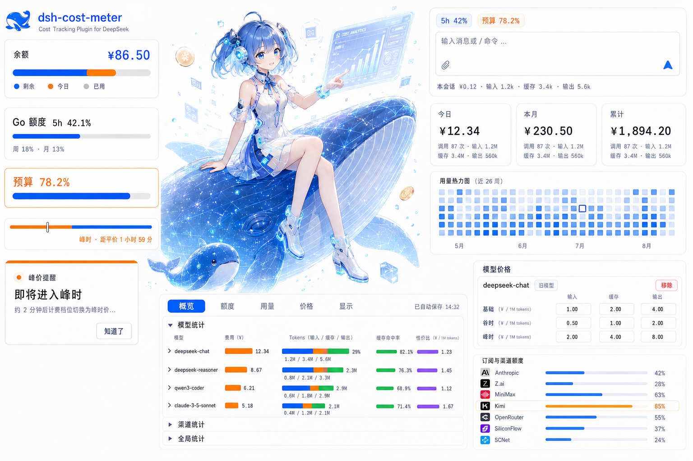

## Feature overview

| Feature | Location | Description |
|---|---|---|
| Per-conversation cost | Below the composer / session title bar | Live accumulated cost + input/cache/output tokens; position configurable |
| Official balance | Sidebar top / Settings page (configurable) | Total / granted / topped-up balance, auto-refresh + manual refresh |
| OpenCode Go quota | Sidebar / Settings / bottom-right dock (configurable) | Rolling-5h / weekly / monthly usage percent and reset times, each window toggleable independently, budget used % can show alongside; key auto-discovered (opencode login / OPENCODE_API_KEY) or entered manually |
| Today's cost | Sidebar bottom (above the settings button) | “Today ¥x”, hover for call count and token details |
| Budget box | Sidebar bottom (between the balance row and the settings button) | Rounded-square frame: budget, used %, progress bar, today's cost & share of budget, used/limit; ≥80% warning, ≥100% over-budget |
| Summary cards | Settings page | Today / this month / cumulative cost and call counts |
| Today's sessions | Settings page | Per-session call count, input/cache/output tokens and cost |
| History | Settings page | Per-day totals; retention days configurable (default 180) |
| Budget settings | Settings page, top | Limit, period (today / month / cumulative / custom date range), used % |
| Price table | Settings page | Per-model base / off-peak / peak prices; fully editable |
| Peak/off-peak pricing | Settings page | Official DeepSeek peak/off-peak scheme with effective-time gating and live tier status |
| Official price sync | Settings page | Fetches and parses the official pricing page, applies with one click |
| UI language | Settings → Display settings | Simplified Chinese / English / Follow browser (auto); switches instantly and auto-saves |
| AI price sync | [prompt](docs/AI-PRICE-SYNC-PROMPT.en.md) | Hand it to any AI to sync per-model, time-of-day prices on its own |

## Bilingual UI

The plugin UI (session badge, sidebar balance row & budget box, and the entire Settings page) supports **Simplified Chinese** and **English**:

- Language options: **Simplified Chinese** / **English** / **Follow browser (auto)**;
- Default is “Follow browser”: the browser language is auto-detected (`zh*` → Chinese, otherwise English), and the detected value is written back into the config so server-side messages (balance query, price sync, etc.) match the UI language;
- Switch it under **Settings → Cost → Display settings → Language** — the whole plugin UI updates instantly and auto-saves; the section label in the Settings sidebar switches too (费用 / Cost);
- Server-generated notices (balance refresh, official price sync, config validation errors, …) are also output in the current language.

## Screenshots & walkthrough

> All screenshots were captured on a live DeepSeek Harness instance. They show the Chinese UI by default; the plugin UI itself is bilingual (Simplified Chinese / English) — switch to English under Settings → Cost → Display settings → Language.

### Main page

**Sidebar bottom** (top to bottom: official balance → budget box → settings button; with the budget disabled, the balance row still sits above the settings button):

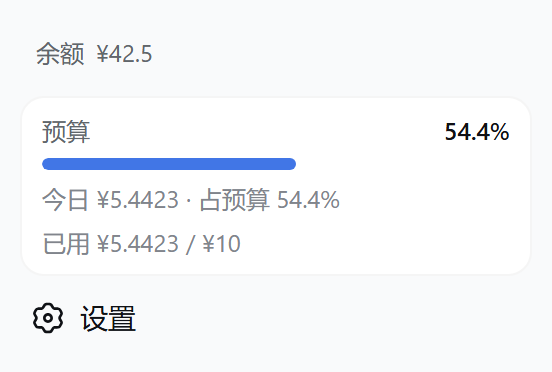

- The balance row shows the official open-platform total balance; hovering reveals the granted/topped-up split;
- With a budget enabled, the rounded-square frame shows “budget · used % · progress bar · today's cost & share of budget · used/limit”; in rail mode it narrows to a percentage tile;

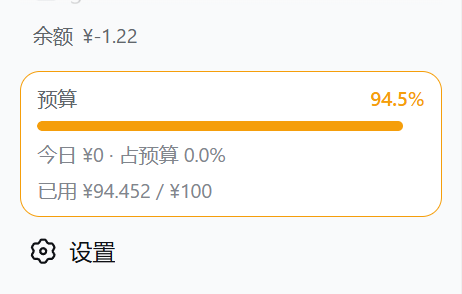

- With no budget enabled, that spot shows the “Today ¥x” badge.

**Per-conversation cost** (two positions, switchable in Settings):

| Below the composer | Session title bar |
|---|---|
|  | 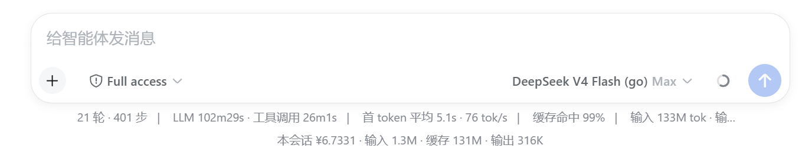 |

> Left: this session ¥5.5939 · input 321K · cache 119M · output 235K; right: title-bar badge “cost ¥6.1606” (real session captures)

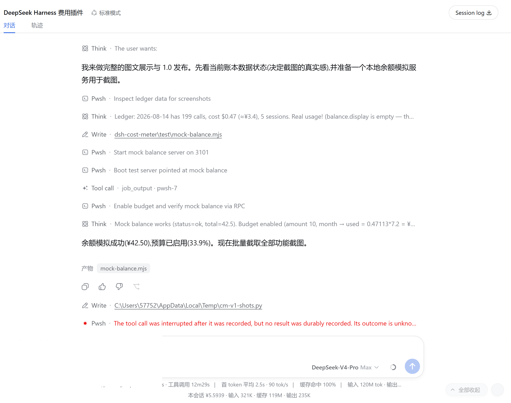

### Settings → Cost

**Overview** (budget → balance → summary cards → today's sessions → history → display settings → price table → data & sync):

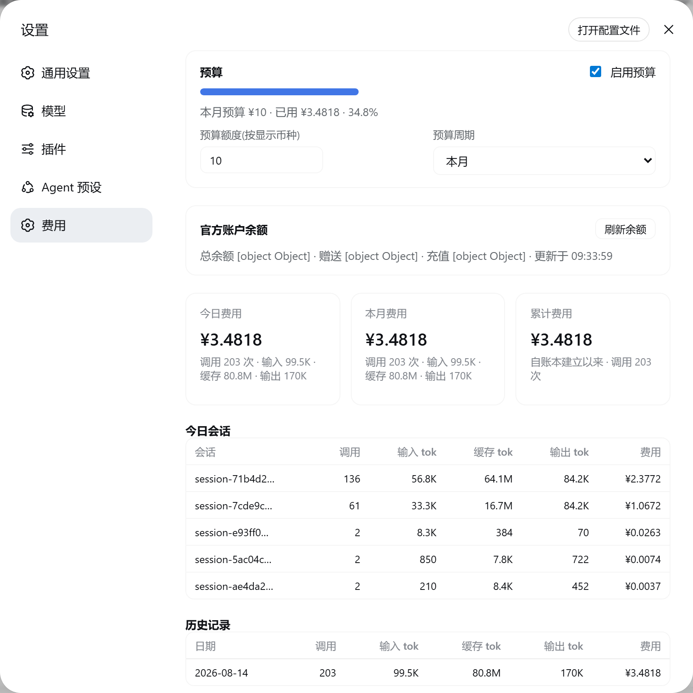

**Budget panel** (top, including custom date ranges):


**Balance panel** (total/granted/topped-up + manual refresh):


**Summary cards**:


**Today's sessions / history** (input, cache and output tokens in separate columns):

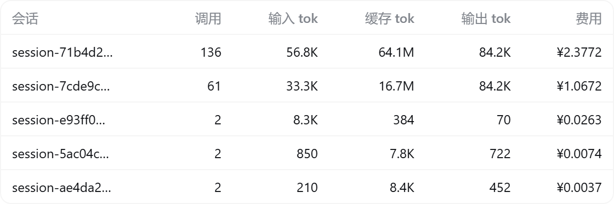 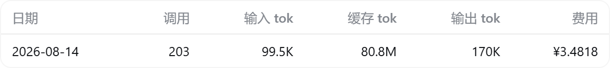

**Price table** (base / off-peak / peak tiers, USD / 1M tokens):

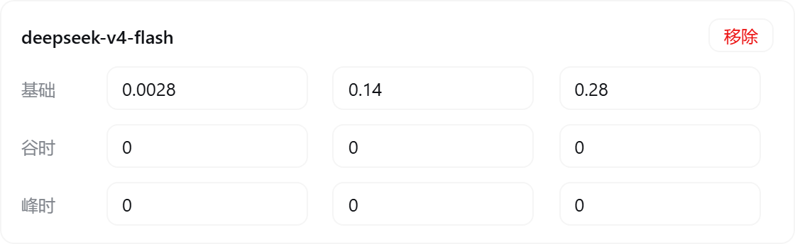

**Data & sync** (instant auto-save of settings + official price sync + clear history):


## Installation

> Requirements: Node.js ≥ 20 + DeepSeek Harness (a version with the `dsh plugin` command; `npm install -g @deepseek-ai/dsh`).

### One-click install (recommended)

**PowerShell one-click script** (copy the whole line, paste, press Enter; pnpm is provisioned automatically, git is auto-detected — no clone needed; the install chain is **pinned to the release tag `v1.2.0`** — review the script before running):

```powershell
irm https://raw.githubusercontent.com/Han-1413141/dsh-cost-meter/v1.2.0/install.ps1 | iex
```

**Or a plain command line** (the machine must already have pnpm and git; also pinned to the tag):

```sh
dsh plugin --profile web add github:Han-1413141/dsh-cost-meter#v1.2.0
```

Without git, use the GitHub tag archive:

```sh
dsh plugin --profile web add https://github.com/Han-1413141/dsh-cost-meter/archive/refs/tags/v1.2.0.tar.gz
```

After installing, **restart** `dsh web` (plugin rows, the Typert manifest and the client bundle are all scanned at startup):

```sh
dsh web
```

### Update / Uninstall

```sh
# update: re-run the new release's install.ps1 (the pinned tag inside it moves with the release)
dsh plugin --profile web remove dsh-cost-meter  # uninstall
```

### Local development

```sh
git clone https://github.com/Han-1413141/dsh-cost-meter.git
cd <parent directory of the clone>
dsh plugin --profile web add link:./dsh-cost-meter  # symlink; edit lib/client.js, refresh the page, done
```

## Billing rules

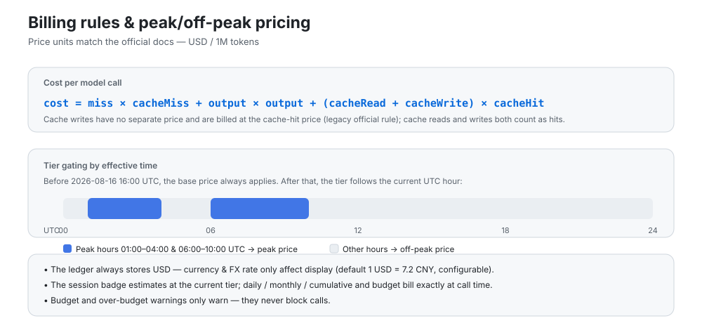

- Price units match the official docs: **USD / 1M tokens**;
- cost = cache-missed input × cache-miss + output × output + (cache read + cache write) × cache-hit (cache writes follow the legacy official rule and are billed at the hit price);
- **Peak/off-peak pricing is gated by effective time**: before `peakEffectiveAt` (default 2026-08-16 16:00 UTC) the base price always applies; afterwards, peak hours (01:00–04:00, 06:00–10:00 UTC) bill at the peak price and all other hours at the off-peak price. The Settings page shows the live tier (not effective / peak / off-peak);
- The ledger always stores amounts in **USD**; currency and FX rate only affect display (default 1 USD = 7.2 CNY, configurable);
- The session badge is **estimated** at the current tier; daily/monthly/cumulative totals and the budget are **billed exactly** at the moment each call is made;
- Billing sources are the `usage` block of every model call (including sub-agents, compression, title generation and other auxiliary calls), matching the billable view;
- Budget and over-budget warnings **only warn — they never block calls**.

## Data storage

- Ledger: `$DSH_HOME/storages/cost-meter/ledger.json` (atomic write + 2-second debounce; retained per `historyDays`, up to 200 per-session entries per day);
- Every settings change is **saved instantly and automatically** (600 ms debounce) — no manual save needed;
- Delete the ledger file to reset everything, or use “Clear all history” in Settings.

## Architecture

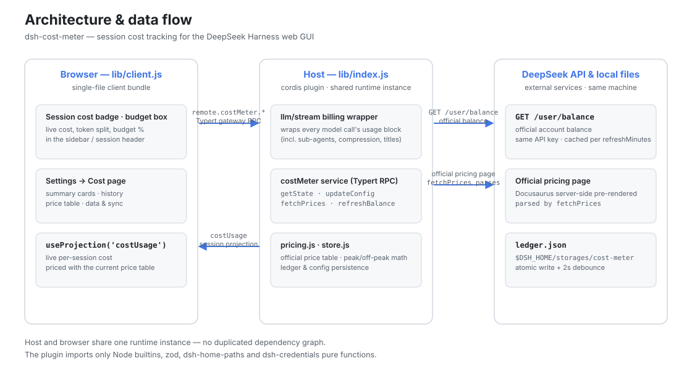

```
dsh-cost-meter
├── cordis.patch.yml        # bundle patch: inserts the cost-meter row into the web profile
├── install.ps1             # one-click install/update script (irm … | iex)
├── .github/workflows/      # CI: install-smoke for the one-click install path
├── package.json            # dsh.bundle patch declaration + dsh.client browser declaration
└── lib/
    ├── index.js            # host plugin: llm/stream billing wrapper, costUsage session
    │                       #   projection, costMeter service (hand-written typertRemote
    │                       #   binding), balance lookup
    ├── pricing.js          # official price table, official page HTML parsing, peak/off-peak math
    ├── store.js            # ledger persistence & config management ($DSH_HOME/storages/cost-meter)
    ├── typert.host.js      # ./typert export: Typert manifest (auto-registered by typert-loader)
    └── client.js           # ./client export: browser single-file bundle (badges/box/settings)
```

Data channels:

- **Per-conversation cost**: the host registers the `costUsage` session projection (pure token buckets, split per model); the browser reads it via `useProjection('costUsage')` and prices it with the current price table;
- **Global ledger / budget / balance / config**: `costMeter/getState | updateConfig | fetchPrices | refreshBalance | resetHistory` over the Typert gateway RPC (`remote.costMeter.*`);
- **Balance**: calls the official `GET {baseURL}/user/balance`, reusing the same API key as model requests (credential service / env var), with an in-process cache expiring per `refreshMinutes`.

The plugin never imports cordis/dsh Service/Context runtime classes (only Node builtins, zod, and pure functions from dsh-home-paths and dsh-credentials), so it shares one runtime instance with the host with no duplicated dependency risk.

## How official price sync works

`fetchPrices` fetches the official pricing page (Docusaurus server-side pre-rendered) and parses:

1. the base price table (transposed layout: first row MODEL + model ids, price labels followed by the prices);
2. the peak/off-peak price table (two rows per model: OFF-PEAK / PEAK);
3. the effective time (“take effect at …”) and the peak-hour windows (“Peak hours are …”).

The parsed result is written into the price table and persisted; if the page structure changes, sync reports an error and keeps the previous prices, with manual editing as a fallback.

## AI price sync

[docs/AI-PRICE-SYNC-PROMPT.en.md](docs/AI-PRICE-SYNC-PROMPT.en.md) (English) and [docs/AI-PRICE-SYNC-PROMPT.md](docs/AI-PRICE-SYNC-PROMPT.md) (中文) provide prompts you can copy straight into any AI:
the AI reads the official pricing on its own → outputs per-model, time-of-day (base/off-peak/peak + effective time) price JSON → you review and apply it (Settings page / RPC / file — pick one). Handy when the official prices change.

## Development & verification

```sh
corepack pnpm install                                   # dependencies
node --check lib/index.js && node --check lib/pricing.js \
  && node --check lib/store.js && node --check lib/typert.host.js \
  && node --check lib/client.js                         # syntax checks
node test/verify.mjs                                    # pure-module verification (parsing/billing/ledger/config)
node test/mock-balance.mjs                              # (optional) local balance API mock: 3101
dsh --profile web --dump-config                         # composition-tree check
dsh --profile web --port 3099                           # real startup (watch logs and the UI)
```

## Known limitations

- Official-page parsing depends on the current page structure; after a redesign, “Sync prices from official docs” fails — edit the price table manually as a fallback;
- The session badge is estimated at the current price tier; exact figures come from the ledger;
- Price sync overwrites the same-named models listed on the official page; custom model entries are unaffected;
- Balance lookup needs network access to api.deepseek.com and a valid API key; **the API key is only ever sent to the official domain** (if baseURL points at a non-official host, balance queries refuse to run — model requests are unaffected);
- The OpenCode Go quota endpoint is the official opencode.ai endpoint (community-documented); if its response shape changes, the Settings page shows an error and the display can be turned off in Display settings;
- A restart of `dsh web` is required after installing/updating the plugin.

## License

[MIT](LICENSE) © 2026 dsh-cost-meter contributors
