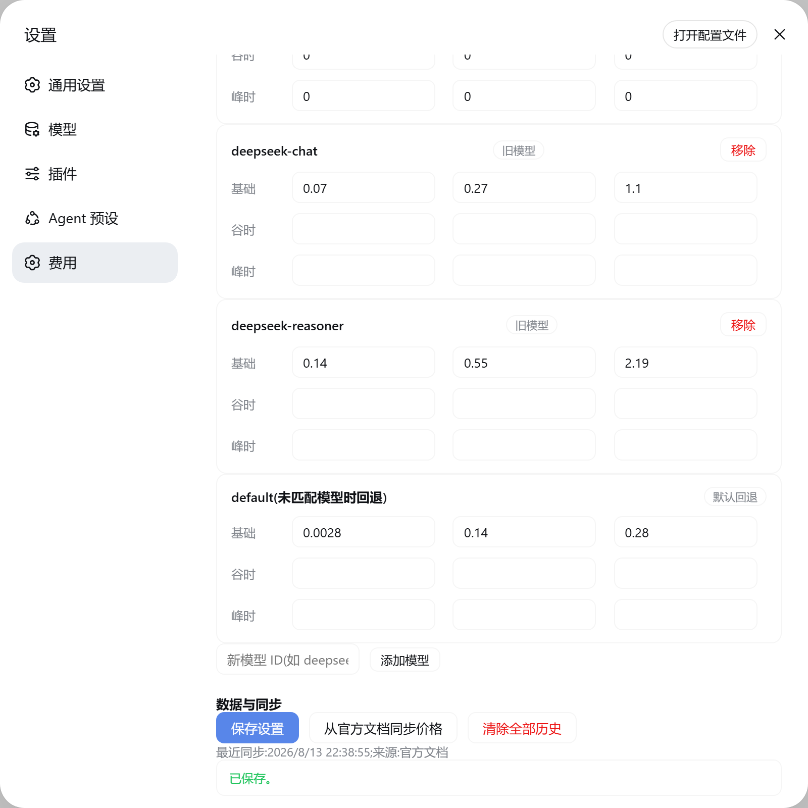

# dsh-cost-meter

DeepSeek Harness 会话费用统计插件:在页面上显示**本会话费用**、**当日费用**,并在设置中提供**累计费用与历史记录**页面,支持通过官方文档一键同步价格。

*A cost-tracking plugin for the DeepSeek Harness web GUI: per-conversation cost, daily totals, a full history dashboard in Settings, DeepSeek peak/off-peak pricing, and one-click price sync from the official docs.*

## 截图

| 侧边栏当日费用 | 设置 →「费用」页面 |
|---|---|
|  |  |

## 功能

- **本会话费用**:在输入区下方(默认)或会话标题栏显示当前会话的累计费用与 token 用量(输入/缓存/输出分开);位置可在设置中切换或关闭。
- **当日费用**:侧边栏底部实时显示「今日 ¥x.xx」,悬停可见今日调用次数、输入/缓存/输出 token、本月与累计费用。
- **设置 → 费用** 独立页面:
  - **预算(顶部)**:启用后设置预算额度与周期(今日/本月/累计),显示已用金额与已用百分比进度条,≥80% 预警、≥100% 超支;
  - 汇总卡片:今日 / 本月 / 累计费用(含调用次数与输入/缓存/输出 token);
  - 今日会话明细:每个会话的调用次数、输入/缓存/输出 token 与费用;
  - 历史记录:按天汇总(日期、调用、输入/缓存/输出 token、费用);
  - 显示设置:会话徽章位置(dock / header / 关闭)、侧边栏开关、货币单位(CNY/USD/EUR)、货币符号、汇率、小数位数;
  - 价格表:每个模型的 基础/谷时/峰时 三档价格(美元 / 1M tokens),支持手动增删改;
  - 峰谷计价开关(DeepSeek 官方 2026-08-16 起实行的峰/谷时段计费);
  - **从官方文档同步价格**:抓取并解析 [DeepSeek 官方定价页](https://api-docs.deepseek.com/quick_start/pricing),一键应用全部模型价格(含峰谷档与生效时间);
  - 清除全部历史。

## 安装

```sh
dsh plugin --profile web add ./dsh-cost-meter
```

安装后**必须重启** `dsh web`(插件行、Typert 清单与客户端 bundle 均在启动时扫描):

```sh
dsh web
```

移除:

```sh
dsh plugin --profile web remove dsh-cost-meter
```

## 计费规则

- 价格单位与官方文档一致:美元 / 1M tokens。
- 成本 = 未命中输入 × cache-miss + 输出 × output + (缓存读 + 缓存写) × cache-hit。官方页面未单列缓存写价格,沿用官方历史规则按缓存命中价计费。
- 峰谷计价:自 `peakEffectiveAt`(默认 2026-08-16 16:00 UTC)起,峰时段(默认 01:00–04:00、06:00–10:00 UTC)按峰时价,其余按谷时价;可在设置中关闭。
- 账本中的金额恒以**美元**存储;币种/汇率仅影响显示(`exchangeRate` 默认按 1 USD = 7.2 CNY 换算,可改)。
- 会话徽章按**当前档位价格估算**本会话费用(会话投影只含 token 桶);当日/月度/累计为按每次调用实际时刻精确计费的账本数据。
- 计费来源是每次模型调用的 usage 块(包括子代理、压缩、标题等辅助调用),与账单口径一致;失败的请求若携带 usage 也会计入(与 token-meter 的保守口径相同)。
- 预算:额度按**显示币种**设置,已用金额 = 对应周期(今日/本月/累计)美元成本 × `exchangeRate`,与账本同口径;进度条 ≥80% 预警、≥100% 提示超支(仅提醒,不阻止调用)。

## 数据存储

- 账本:`$DSH_HOME/storages/cost-meter/ledger.json`(原子写入、2 秒防抖;按 `historyDays` 保留最近 180 天,每日最多保留 200 个会话明细)。
- 删除账本文件即可清零;或在设置页点「清除全部历史」。

## 架构

```
dsh-cost-meter
├── cordis.patch.yml        # bundle 补丁:向 web profile 插入 cost-meter 行
├── package.json            # dsh.bundle 补丁声明 + dsh.client 浏览器声明
└── lib/
    ├── index.js            # 宿主插件:llm/stream 计费包裹、costUsage 会话投影、
    │                       #   costMeter 服务(手写 typertRemote 绑定)
    ├── pricing.js          # 官方价格表、官方页面 HTML 解析、峰谷计费数学
    ├── store.js            # 账本持久化与配置管理($DSH_HOME/storages/cost-meter)
    ├── typert.host.js      # ./typert 导出:Typert 清单(typert-loader 自动注册)
    └── client.js           # ./client 导出:浏览器单文件 bundle(徽章/侧边栏/设置页)
```

数据通道:

- **本会话费用**:宿主注册 `costUsage` 会话投影(纯 token 桶 + 按模型拆分),浏览器经 `useProjection('costUsage')` 读取并按当前价格表计价;
- **全局账本与配置**:`costMeter/getState | updateConfig | fetchPrices | resetHistory`,经 Typert 网关 RPC(`remote.costMeter.*`)。

插件不导入任何 cordis/dsh 运行时包(仅 Node 内建模块、zod、dsh-home-paths),宿主与浏览器两端均与 Harness 共享同一运行时实例,无重复依赖风险。

### 官方价格同步原理

`fetchPrices` 抓取官方定价页(Docusaurus 服务端预渲染,可直接解析 HTML 表格),按当前页面结构解析:

1. 基础价格表(转置布局:首行 MODEL + 模型 id,价格行标签后紧跟价格);
2. 峰谷价格表(每模型两行:OFF-PEAK / PEAK);
3. 生效时间(take effect at …)与峰时段窗口(Peak hours are …)。

解析结果写入价格表并持久化;页面结构变化时同步会报错并保留原价格,可手动编辑兜底。

## 开发与验证

```sh
# 依赖安装(插件目录)
corepack pnpm install

# 语法检查
node --check lib/index.js && node --check lib/pricing.js && node --check lib/store.js && node --check lib/typert.host.js && node --check lib/client.js

# 纯模块验证:官方页面解析、峰谷计费、账本读写、配置校验
node test/verify.mjs

# 组合验证:安装到 web profile 后
dsh --profile web --dump-config   # 组合树校验
dsh --profile web --port 3099     # 真机启动(观察启动日志与浏览器 UI)
```

## 已知限制

- 官方页面解析依赖当前页面结构;页面改版后「从官方文档同步价格」会报错,可手动编辑价格表兜底。
- 会话徽章按当前价格档位估算,不做历史时刻回放;精确费用以账本为准。
- 价格同步会覆盖官方页面列出的同名模型价格;自定义模型条目不受影响。
- 安装/更新插件后需重启 `dsh web` 生效(客户端 bundle 按启动时扫描缓存)。

## License

[MIT](LICENSE)
