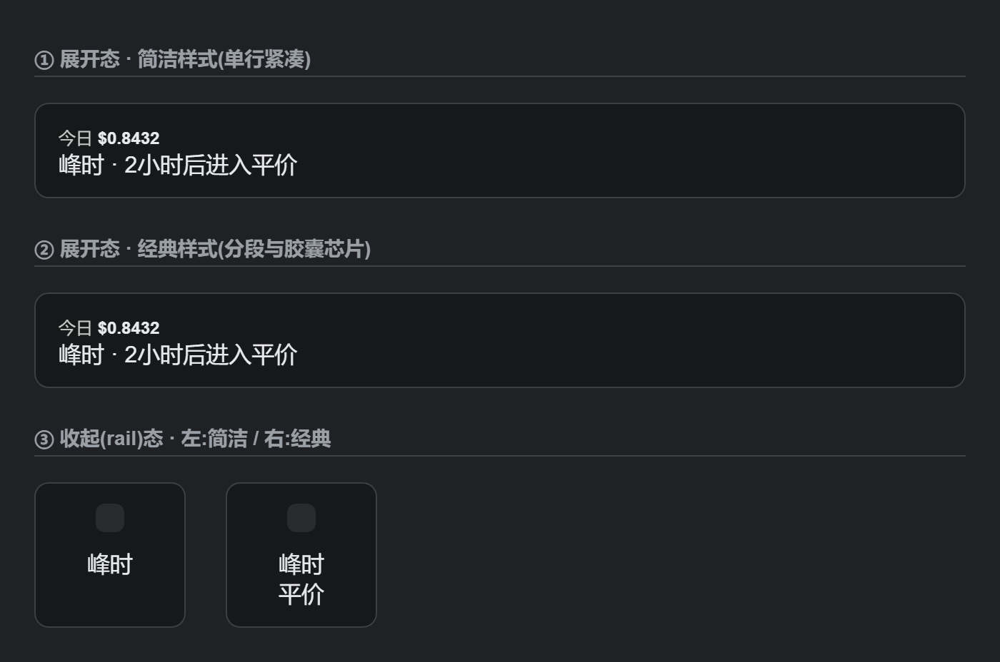
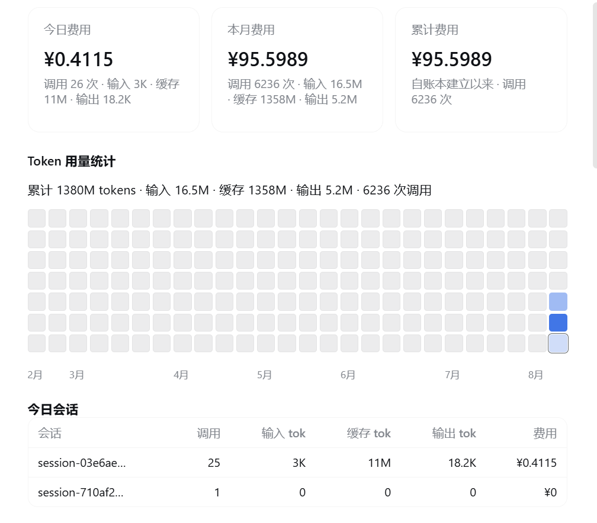
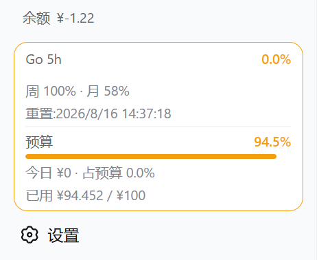

# dsh-cost-meter 版本更新历史

> 本文是面向使用者的版本更新总览；逐条开发记录见 [CHANGELOG.md](../CHANGELOG.md),完整提交历史见
> [Commits](https://github.com/Han-1413141/dsh-cost-meter/commits/master)。

## v1.6.3(2026-08-27)—— modlens 包装层重复计费修复 + 火山方舟 Coding Plan 额度解析
- **修复:modlens 视觉包装层重复计费(issue #70,报告 @lucas-wang-1)**:modlens 为纯文本模型路由自动注册 `modlens-<upstream>` 视觉包装模型并在监听器体内再发起一次上游调用,逃逸嵌套调用标记,实时钩子/会话投影/历史回放把同一次调用记两遍(token/费用翻倍)。三个计费入口统一跳过包装层 provider,只记上游真实流;**历史账本一次性清洗**(镜像对扣除、合并残留改挂上游等四形态,幂等迁移 `modlens-wrapper-dedup-v1`)。
- **修复:火山方舟 Coding Plan 额度解析失败(issue #71,报告 @suyukun)**:Action 白名单缺官方用量接口 `GetCodingPlanUsage`(原首位的 `GetAFPUsage` 实为 AgentPlan 接口,CodingPlan 用户拿到全 0/空)。补 `Result.QuotaUsage[]` / `Level` 三窗解析,原 Action 保留兜底。
- 测试 verify.mjs 全量通过,新增 modlens 去重(id 判定/四形态清洗/回放单记/接线)与火山 CodingPlan 解析两组回归。

## v1.6.2(2026-08-26)— 💰 计费逻辑专项审计修复
- **修复(高危):客户端回退计价金额放大汇率倍**(parseConfig 白名单丢 prices.currency,CNY 价目下徽章/明细 ×7.2)、**第三方模型「取消挂载」失效**(mergeDeep 把已删模型复活)、**自定义余额空值强转残留**(null/空串伪装成「余额 $0」,B-3 变体)。
- **修复(计费正确性):模型名数字分叉三条绕过路径**(`glm-5.3` 套 `glm-5` 旧价 ~29% 低计,双端镜像同步)/ **usage:null 判空击穿**(投影中断、有效快照被覆盖致整次调用漏计)/ **Anthropic 子配额覆盖主周窗**(`seven_day_sonnet` 顶替整体百分比)/ **backfill 全覆盖判定漏 reasoning** / **apiCost>cost 倒挂封顶** / **hunyuan-a13b CNY 价按 USD 入账(~7 倍高估)折算修正**。
- **修复(额度/面板):MiniMax 国际域 Key 401 即失败**(换域重试补齐,issue #42 同型)/ **Kimi 滚动窗落 48h 兜底**(满窗估算单位错配)/ **清空价格档写显式 0 价**(该档静默变免费;输入组件 emptyMode 三档语义)/ **官方余额符号错位**(¥53 显示成 $53)/ **跨厂商兑底 billingMode 失步**(客户端 flat vs 服务端峰谷两档)。
- **加固:中文峰窗口正则放宽**(官方页紧凑排版不再静默沿用旧窗口)、turn/step 去重键与回放对齐、fetchWithRetry 保留调用方取消信号(AbortSignal.any 组合)。
- 测试 verify.mjs 全量通过并补 20+ 条回归断言;OpenCode 目录夹具 70/70 对齐。

## v1.6.1(2026-08-26)—🛡 全仓安全审计修复
- **修复(高危×3):账本退出丢写**(close 先关门再落盘,最终 flush 从未生效)/ **发版脚本命令注入**(UPDATE-HISTORY 标题拼进 shell,改 execFileSync 数组参数)/ **Go 月窗空值崩溃**(额度框 monthly 未判空,整树崩溃)。
- **修复(计费正确性):路由调用小时桶漏记**(今日段本地量系统性偏低)、**历史重算 apiCost 倒挂**、**DeepSeek 分支两桶简写 NaN 入账**、**SCNet 周期末日少一天**。
- **修复(UI/链路):官方余额对账告警失效**(客户端丢弃 reconcile 字段)、**自定义余额提取失败误显 $0**、**计费流中断泄漏**(上游照扣本地漏记)、**额度查询 200+HTML 击穿多端点回退**、设置页自动保存并发回滚竞态及十余项低危批次。
- **加固:账本损坏自动备份**(.corrupt-* 改名留存)、**写失败自动重试**、配置补丁原子性(结构化克隆)、原型链/凭据 `$&` 序列/实体双重解码加固、目录抓取千分位与括号价支持、路由缓存 WeakMap、启动导入异步让步、install.ps1 corepack 兼容与清单解析报错。
- 逐项审计清单与验证记录见 [security-audit-v1.6.1.md](security-audit-v1.6.1.md);测试 verify.mjs 全量通过、OpenCode 目录夹具 70/70 对齐。

## v1.6.0(2026-08-25)—✨ 计费口径一致性重建 + 「含 Plan 总额」全局开关
- **修复:累计费用失真(用户实测:插件 $5.26 vs 桶级分布 $12.41)**:桶级 apiCost 从不回写、容器值来自不同时刻——现一致性重建迁移(billing-rebuild-v3)按分类回写桶级并重算容器,幂等。
- **新增:「含 Plan 总额」全局开关**(概览页汇总卡片下方,即时生效):关闭 = 真金白银 API 口径;开启 = 含 Plan 等值的旧总额;覆盖卡片/徽章/预算/表格/会话徽章全部金额展示。
- **新增:路由调用归类**(provider 空/'deepseek' + 第三方目录模型 → go);**modlens-zen 无特判统一按 api 计**;**无明细残差归 API**。

## v1.5.53(2026-08-25)—🛠 百分比量化误差:段式差分 + 置信标注
- **修复:每 1%/满窗估算对百分比读数量化敏感(用户复核追问)**:读数只精确到个位时,逐对差分误差可达 ±50% 以上;改为「连续可信段首尾差分」——中间读数的量化噪声两两抵消,跨度越大越准(Δp≥5 标 high,不足标 low 并在方法列提示「读数精度受限」)。
- **修复:DeepSeek/空 provider 渠道误套默认低价(用户实测)**:第三方模型(minimax-m3 等)被套 DeepSeek 默认价($0.22/M),773M tokens 差 5-15 倍;现 DeepSeek 分支内先跨目录最佳匹配兑底,真 DeepSeek 模型不受影响。
- **zen 路由 `gemini-3.1-pro` 精确计价条目**(对表夹具 70 条全对齐)。

## v1.5.52(2026-08-25)—🛠 Token Plan 算法修复 + 历史 Plan 自动归类
- **修复:Token Plan 周/月估算系统性偏低(用户反馈复核)**:周期首日(周一/每月 1 日)整天被丢弃、凌晨 5 小时窗丢失昨日尾部;改为时间区间与「日」求交的精确聚合,首日尾部与今日由小时桶覆盖。
- **修复:重度使用下 5 小时窗低估**:环形缓冲 2000 条硬截断 → provider×小时聚合桶(48h 无截断),旧数据自动转换。
- **新增:历史 Plan 渠道静默自动归类**:启动扫描账本中用过的 Plan 渠道,「auto+未配置」的自动归入 plan 并重算历史 apiCost。
- **新增:采样区间 7 天时效 + 基准时刻标注**;zen 路由 `gemini-3.1-pro` 精确计价条目;`llm-` 前缀归并对齐。

## v1.5.51(2026-08-25)—✨ Plan/API 双轨计费分离 + Token Plan 用量统计
- **新增:Plan/API 双轨计费分离(issue #64,报告 @mumchristmas)**:MiniMax/Codex 等订阅制渠道的调用此前按目录 API 价计入金额,导致每日真实支出虚大。现账本同时记录总等值金额与真金白银(apiCost),预算/今日费用/概览卡片等只统计 API 部分,订阅消耗以等值口径单独呈现;同一会话两类渠道并存可精确区分;历史数据自动回溯拆分(幂等)。
- **新增:Token Plan 用量统计面板(设置 → 用量)**:每 1% 额度与满窗 100% 对应的 token 数/等值金额估算(采样差分,样本不足回退当前用量折算),附每日/每周/每月曲线;覆盖全部已启用 Coding Plan 与 OpenCode Go。
- **新增:按模型统计行「API 按量 / Plan 订阅」计费方式标记**。
## v1.5.50(2026-08-25)—— 修复 非 fork 会话代币漏计
- **修复: 对话框下方本会话统计与今日会话不一致(issue #63 @Alan0x01)**:普通会话的 `length` 被误作 `seedLength` 导致早期 token 被过滤为种子,现仅显式 `seedLength` 生效,`length` 仅 fork 时回退;`stateVersion 6→7` 触发重放自愈。

## v1.5.49(2026-08-25)—— 修复 人民币币种会话费用虚高
- **修复: 人民币价格会话费用虚高(issue #62 @Alan0x01)**:`CNY` 价格直接计为美元后展示再 `×7.2`,现投影与客户端回退均按 `÷exchangeRate` 落库为美元,显示往返一致。

## v1.5.48(2026-08-25)—— 修复 火山方舟探测顺序与 daily 窗口
- **修复: 火山方舟 GET 用量探测优化(issue #60 反馈 @sanqiPanax)**:`GetAFPUsage` 优先,减少 `GetUsageDetails` 400 探测;新增 `daily`/`AFPDaily` 窗口归一。

## v1.5.47(2026-08-25)—— 修复 fork 多 end-seed 边界
- **修复: fork 会话徽章仍显示全量费用(issue #61, 跟进 @csliuchi)**:`v1.5.43` 的 `end-seed` 取首个边界,父会话重启的 `end-seed` 被拷进种子段导致中间种子漏扣(256 条 usage);`v1.5.47` 改为取种子段内最大边界、延迟至首个 own 事件整段扣回,header 的 `seedLength` 作为边界,子会话自身重启的 `end-seed` 过滤; `stateVersion` 5→6 触发重放自愈。

## v1.5.46(2026-08-25)—— 新增 火山方舟 Volcano Ark Coding Plan
- **新增:火山方舟 Volcano Ark Coding Plan 额度查询(issue #60, 需求 @sanqiPanax)**:第 9 家 Coding Plan——管控面 `open.volcengineapi.com`(Action `GetUsageDetails`/`GetPersonalPlan`/`GetAFPUsage`, service `ark`) 走 AK/SK HMAC-SHA256 签名(非 Bearer),需 IAM 子用户双权限,三窗口 5h/weekly/monthly 归一化与其它 8 家同款卡片/横条/点击刷新;配置双字段 `accessKeyId`/`secretAccessKey`(兼容环境变量与 `AK:SK` 冒号写法),凭据仅发往官方域名,含签名/解析/清洗/端点白名单与客户端双输入框的 verify 覆盖。

## v1.5.45(2026-08-25)—— 进度条方向统一 + 目录价格对表夹具 + 充值直达与 Codex 周额度

- **修复:Plan 类余额进度条方向统一(issue #57,报告 @mumchristmas)**:MiniMax 卡片此前按「余量」填充、其它厂商按「已用」填充,同屏方向相反;现全部统一为「已用」(条越满用得越多),告警阈值同步对齐。
- **修复:OpenCode 目录价格漂移(issue #58,实测与脚本 @xyzs996)**:`gpt-5.6-sol` 降价六成($2/$10/缓存读$0.20,>272K 档 $4/$15;09-18 前五折促销价已注明);`opencode-go.glm-5.3` 按目录价补齐 $1.40/$4.40/$0.26(z-ai 维持不编造);新增 `muse-spark-1.2`(Meta)、`longcat-2.0`(美团)、`muse-spark-1.2-contributor` 三个模型;新增 `test/check-opencode-catalog.mjs` 对表夹具(69 条全对齐)与 `scripts/gen-provider-pricing.mjs` 再生成脚本。
- **新增:DeepSeek 充值直达(issue #59)**:官方余额旁「↗」新开平台账单页直达充值,不影响点击刷新。
- **新增:ChatGPT(Codex)周额度显示(issue #59)**:安装 dsh-codex-connect 并登录后自动出现 Codex 周额度卡片与额度横条 chip(同源只读探测、零配置、无凭据读取),插件不在时自动隐藏。

## v1.5.44(2026-08-24)—— 安全加固:Kimi 端点识别精确化

- **修复:Kimi 订阅端点识别改用 URL 主机名精确匹配(CodeQL 高危告警 no. 6)**:此前用子串匹配判断当前请求是否 `api.kimi.com` 订阅端点,理论上可被恶意相似域名误命中;现改为主机名精确等值(大小写归一),对正常使用行为无任何变化,仅消除安全隐患。

## v1.5.43(2026-08-24)—— fork 会话徽章费用修复 + 手动价格映射自愈

- **修复:fork 会话「本会话」徽章仍显示全量费用(issue #55,根因分析 @csliuchi)**:fork 出来的会话,徽章把从父会话拷贝来的历史用量一并计入(如缓存显示 157M 而非 fork 自己的 ~65M)。原因是插件投影拿不到会话创建时刻,无法区分拷贝段;现已改用宿主日志中的 `session/end-seed` 边界标记精确扣除拷贝段,账本侧数据本就正确、不受影响。升级重启后徽章自动恢复正确(受污染的旧状态会被宿主重建)。
- **修复:第三方渠道手动指定 DeepSeek 价格后金额显示 0(issue #56)**:设置页「手动指定价格」下拉框此前把 DeepSeek 目标模型存成了缺前缀的名字,跨渠道映射因此查不到价格、金额归零。现下拉框存储带 `deepseek:` 前缀的正确格式;已保存过的旧格式映射也会在查价时自动按 DeepSeek 价签兜底命中,**无需手动修正配置**。升级后重启 dsh web 即可。

## v1.5.42(2026-08-24)—— 额度横条修复 + Kimi 订阅配额

- **修复:输入框上方额度横条(issue #52,报告者 @ProximaCentauri0)**:迷你进度条现在真实显示填充(此前因 CSS display 缺失永远空白);点击横条上的任意 chip 即可刷新对应数据源,不用再去侧边栏找刷新按钮;同一厂商的多个额度窗口(如 Z.ai 的 5 小时档 + 周档)合并为一条 chip 分段显示,不再占多个位置。
- **新增:Kimi Code 订阅配额查询(issue #53,方法贡献者 @Angelyeye)**:Kimi 项现在显示订阅的真实配额(本周 + 5 小时滚动窗口用量% 与重置时刻),不再只有 PAYG 余额;填 `KIMI_CODING_API_KEY`(sk-kimi-* 订阅 Key)即生效,没有订阅 Key 时自动回落显示原来的 PAYG 余额。
- **新增:周末全谷价规则回归夹具(issue #54,向量提供者 @xyzs996)**:15+3 条边界一致性断言钉住「周末按北京时间日历全天谷价」这条规则,防止未来重构时悄悄改错(改错这类规则的麻烦是测试照样全绿)。

## v1.5.41(2026-08-23)—— 启动 OOM 修复

- **修复:大会话日志导致 dsh web 启动崩溃(issue #50,PR #51,感谢 @cftest120241104-lang)**:有长期大会话(日志解压后数百 MB)且账本里存在标题还没写进日志的活跃会话时,插件启动后约 20 秒内内存耗尽崩溃。已按 PR 原样采用两层修复:大日志改为逐帧流式解压解析(峰值内存降到约四分之一),标题补齐只读缺失标题的那份会话日志(不再每次启动重扫全部日志);历史账单数字分毫不受影响。

## v1.5.40(2026-08-22)—— 周末全谷价适配

- **周末全谷价适配(官方通知:2026-08-23(周日)00:00 北京时间起,周六及周日全天不再区分峰谷,统一按低谷时段价格计费)**:计费侧新增「周末全谷价」区间(北京时间周六/周日日历日,生效时刻起)——周末恒按谷时档(offPeak)计费,峰窗口在周末不再生效;生效前的费用仍按原峰谷规则结算(首个受覆盖的周末仅周日全天,自 2026-08-29 起周六、周日全天均为谷价),历史账单分毫不受影响。展示侧四处时段条(展开/收起 × 简洁/经典)周末显示「周末时段——全谷价 · 倒计时」(收起态短词「周末全谷」,绿色系标识省钱档,标记线居中指向全谷轨道);倒计时直达下个工作日首个峰时段起点(周五晚 → 周一 09:00 之间不再出现虚假的「进入平价」切换提示);设置页峰谷面板状态行同步周末感知,并新增新规说明文案。verify.mjs 新增周末区间边界、窗口判定、计费档位与相位倒计时全套断言。

## v1.5.39(2026-08-22)—— 隐藏开关改为 UI 隐藏

- **修正:隐藏官方余额/今日消耗金额改为真正的 UI 隐藏(issues #45 / #46,建议者 @JayWu199751)**:v1.5.38 的「隐藏金额(隐私模式)」把金额打星(`$ ***`),不是期望的效果——现在改为开关开启后对应 UI 区块**整体消失**:「设置 → 显示 → 隐藏官方账户余额」开启后侧边栏余额行/余额进度条、会话页与设置页的官方余额面板全部不再显示;「隐藏今日消耗金额」开启后侧栏今日费用行、预算盒明细与悬停提示中的今日金额、概览页今日卡片全部不再显示。token 与调用次数统计不受影响;v1.5.38 期间开启过隐私模式的配置字段自动清理。

## v1.5.38(2026-08-22)—— 包装路由去重 + 隐私模式

- **修复:modlens / vision-router 包装路由下费用虚高 2~3 倍(issue #48,报告者 @aiseaai)**:这类包装插件会在内部把请求再转发一层给上游 provider,旧版计费把每层都当成独立请求记账(报告者当天账本里 official / modlens / modlens-vision 三行 token 逐位相同,同一批请求记了 3 份)。现已改为只由最外层记一次账,直连官方路由数字不变。**升级后首次启动会自动扣除已污染的重复账目**(按 token 指纹逐位相同识别,真实调用不受影响),今日费用会立刻回落到与官网一致。
- **新增:隐藏金额隐私模式(issues #45 / #46,建议者 @JayWu199751)**:「设置 → 费用 → 显示设置 → 隐藏金额(隐私模式)」一键把所有余额与费用金额遮罩为「$ ***」——共享屏幕、截图不再泄露消费数字,token 统计照常显示。

## v1.5.37(2026-08-22)—— 智谱 Lite 套餐适配

- **修复:GLM Coding Lite 套餐额度查询失败(issue #44)**:v1.5.36 适配的智谱新接口只认 Pro/Max 套餐的 `TOKENS_LIMIT` 条目,Lite 套餐返回的是 `CREDIT_LIMIT`(按 Credit 计费),被跳过后回落到已 404 的旧端点,报「HTTP 404」误导排查方向。已一并接受 `CREDIT_LIMIT`(字段语义完全一致),Lite 用户现在能正常看到 5 小时档 / 每周档额度。
- **改进:Coding Plan 查询报错不再指错方向(issue #44 建议)**:多端点尝试全部失败时,优先报「主端点返回了数据但结构解析失败」这一更有诊断价值的错误,不再被兜底端点的 404 盖住。

## v1.5.36(2026-08-22)—— 智谱 Coding Plan 新接口适配

- **修复:智谱 / Z.ai Coding Plan 额度查询失效(issue #42)**:智谱官方把额度接口迁移到了 `/api/monitor/usage/quota/limit`,旧接口对新套餐不再返回数据,导致面板查询报错。已适配新接口的 5 小时档 + 每周两窗口(含老套餐单窗口形态),并保留旧接口兜底。另修复一个老问题:国内(bigmodel.cn)与国际(z.ai)的 Key 不互通,以前国内 Key 先请求国际域名收到 401 会直接报「凭据无效」,现在会自动换域重试、全部失败才提示。

## v1.5.35(2026-08-21)—— 未命中列表口径修正 + 外部查询自动重试

- **修复:「未命中模型」列表误报(路由 provider 前缀)**:像 `go:deepseek-v4-flash`、`opencode:gpt-5.6-luna` 这类经路由入口的模型,计费上早已按模型名正确命中价格(跨厂商兑底),但设置页待处理列表仍按裸键查找把它们列为「未命中」。现列表判定与计费口径完全一致:已正确计价的模型不再出现,只剩真正需要人工指定价格的(DeepSeek 默认价兜底或完全未命中)。之前为这类键手动设置过的匹配覆盖仍保留,可在列表中复核移除。
- **修复:外部查询失败后被缓存钉死,断网恢复不自动重试(PR #40,贡献者 @yanzhaohui1999)**:余额/Go 额度/自定义余额/Coding Plan 额度查询失败时也计入「已刷新」时间戳,缓存有效期内轮询一律跳过,瞬时网络抖动要等整个刷新间隔过期(或手动刷新)才恢复。现在临时性失败会显示错误提示并按轮询节奏自动重试;不会自愈的配置类错误(未配置 Key/未登录/无订阅)仍只提示一次不重复请求。

## v1.5.34(2026-08-21)—— fork 会话去重 + dsh 0.1.1-rc.1 适配

- **修复:fork 会话把父会话历史费用重复计算(issue #38)**:DSH 的 fork 会把父会话事件流整段拷贝进新会话,旧版无差别计数导致子会话徽章与账本日合计虚高(父会话的历史被再记一遍)。现已按「事件时间早于会话创建时刻 = 父会话拷贝」识别并跳过;升级后首次启动自动一次性清洗已污染的账本(只扣 fork 拷贝的部分,父会话与普通会话分毫不碰),会话徽章经宿主重放自动恢复正确。非 fork 会话不受影响。
- **适配:dsh 0.1.1-rc.1 下输入区下方的会话费用不再显示(PR #39,贡献者 @aaronlei)**:该版本起宿主要求会话投影声明 `wire` 才向客户端推送,未声明的投影客户端一律收不到。本插件已补齐声明(并同时声明新契约的 `stateSchema`,防持久化恢复报错);旧版 dsh(0.1.0 及更早)不受影响。升级后重启 dsh web 即恢复显示。

## v1.5.33(2026-08-21)—— 引导卡已读标记双通道

- **修复:点击刷新引导卡每次刷新后重现**:「知道了」的已读标记此前只存于配置,经 RPC 往返;当服务端与浏览器端版本错位(升级后未重启 dsh web 的窗口期,或开发模式),网关按旧版 schema 解码会把新增的标记字段剥掉,客户端读不到,卡片于是反复出现。现已读标记改为**配置 + localStorage 双通道**,本地标记不经网络,任一生效即永久消失;重启 dsh web 后两条通道同时对齐。

## v1.5.32(2026-08-21)—— 点击余额图框立即刷新 + 峰谷通知去重

- **侧边栏余额/额度图框点击即刷新(issue #37)**:官方余额、自定义余额与各 Coding Plan 图框(含窄栏收起态)现在点击就会立即查询最新数据,不用等自动刷新间隔、也不用进设置页;刷新中图框呼吸闪烁,失败保持原值、原因进悬停提示,连点会被忽略;键盘 Enter/Space 同样有效。更新后首次进入会弹一张非模态引导卡说明此功能(「知道了」永久消失)。新装/升级后无需任何配置即可使用。
- **修复:峰/谷切换的浏览器(系统)通知连发**:旧版防重逻辑实际无效,提前量窗口内(默认 2 分钟)每 10 秒弹一条、最多约 12 条;现在同一切换点只发一次,配置变化导致组件重挂后也不会重发。
- **修复:点击刷新引导卡「知道了」体验加固**:与额度横条首次引导卡改为串行出现(避免两张顶部浮层卡片重叠互顶);点击后立即消失(写盘失败才恢复),RPC 往返已通过含网关校验的 e2e 验证。
- **新增 DeepSeek-V4-Flash-Vision-Exp 计价**:与 deepseek-v4-flash 同价(谷时 $0.007/$0.22/$0.66、峰时 $0.014/$0.44/$1.32),内置价格表与设置页价格目录同步支持,升级后自动生效。

## v1.5.31(2026-08-21)—— 官方余额进度条渠道拆分

- **官方余额条的「当日已用」只统计官方渠道费用(issue #36)**:同时启用官方余额与 Coding Plan / 自定义 Provider 时,这些渠道的本地账本费用此前也会进入官方余额进度条的「当日已用 / 已用」段,与开放平台实际扣款不一致。现只统计会扣 DeepSeek 开放平台余额的调用,订阅/自定义渠道消耗只体现在各自的额度条上;余额差对账(⚠ 提示)同步修复,订阅用户不再被误报「偏差较大」。

## v1.5.30(2026-08-21)—— 自定义 Provider 余额 extract 支持 divide 运算

- **extract 规则新增 `divide` 除法缩放(NewApi 等 quota 端点适配,贡献者 @CialloAlone)**:自定义余额的解析规则此前只有点路径 / 数字常量 / add / subtract,而 NewApi 的余额以 quota 整数计量(1 USD = 500000 quota),cc-switch 等工具需 `total_available / 500000` 才能换算成美元。现支持 `{"op": "divide", "path": "data.total_available", "by": 500000}`,remaining / maxBudget / spend 三个字段可独立使用;边界(路径缺失、除数为 0、缺除数、目标非数字)返回 null 不中断。README(中/英)新增 NewApi 模板完整配置示例,测试套件新增 divide 换算与边界单测。

## v1.5.29(2026-08-20)—— Coding Plan 刷新间隔可设置

- **Coding Plan 各家新增「刷新间隔(分钟)」控件(issue #33)**:此前刷新间隔只能手改账本;现每家配置区(启用后)可直接填 1-1440 分钟,保存后立即生效,与官方余额 / Go 额度 / 自定义余额的间隔控件同款。SCNet 为本地计量、无缓存间隔,不显示该控件。

## v1.5.28(2026-08-20)—— 修复额度横条引导卡 React #300

- **首次更新引导卡点击「开启/暂不」后控制台报 React #300(issue #32)**:引导卡组件的 `useRef` 写在了两个条件 `return null` 之后,点击按钮把 `promptSeen` 写为 `true` 的那次渲染会少调用一个 Hook,React 以「Rendered fewer hooks than expected」报错并重新挂载 sidebar footer。修复后 Hook 调用顺序在每次渲染保持一致;引导卡行为本身不变(选择后永久消失)。测试套件新增 Hook 顺序门禁,今后任何组件把 Hook 写在条件返回之后都会在验证阶段被拦截。

## v1.5.27(2026-08-20)—— 输入框上方额度横条

- **输入框上方额度横条**:在输入框上方以一条横排 chips 实时显示**预算已用% / OpenCode Go 主窗口 / 各已启用 Coding Plan 前两个用量窗口**——每片「短标签 + 迷你进度条 + 百分比」,≥80% 预警、≥100% 超支着色,悬停见全部窗口、重置时刻与更新时间;无可用额度数据时整条自动隐藏。默认**关闭**,更新后**首次打开会弹一张引导卡由你自主决定开启与否**(选择后永久消失);开关与内容细化(预算/Go/Coding Plan 三项独立开关)在「设置 → 显示 → 输入框上方额度横条」。
- 数据口径与侧边栏图框完全一致(预算按周期与汇率、Go 主窗口、Coding Plan 仅统计启用且查询成功的厂商),无新查询、无新凭据。

## v1.5.26(2026-08-20)—— Coding Plan 额度可显示在侧边栏

- **Coding Plan 额度侧边栏显示(issue #31)**:每家 provider 新增「显示位置」(主页面侧边栏 / 设置页 / 两者 / 关闭,默认设置页),选中侧边栏/两者后额度以图框卡片常驻侧边栏——与 Go 额度/余额同款,每窗口一行进度条、余额类文本窗口整行文本,≥80% 预警、≥100% 超支着色,悬停见全部窗口/重置时刻/更新时间;侧边栏收起窄栏显示前两档百分比。MiniMax 沿用 5h/7d 专用卡片,其余七家(含 CommandCode)走通用卡片;设置入口在「额度 → Coding Plan」各家行内。旧版 MiniMax「启用即上侧边栏」的行为经一次性迁移保持不变(迁移只跑一次,此后尊重用户的显式选择)。

## v1.5.25(2026-08-20)—— 新增 CommandCode 为第 8 家 Coding Plan

- **CommandCode(commandcode.ai)接入(issue #30)**:Coding Plan 面板从七家扩至八家。官方 billing credits 端点(硬编码白名单,凭据只发往 `api.commandcode.ai`)查询 **5 小时/周滚动窗口用量%**(used/cap,进度条 + 重置时刻)与**月度 Credits 余额文本**(1 credit ≈ $1,与 Kimi/SiliconFlow 余额同形态);凭据走通用发现链(面板 Key → DSH 凭据库 `COMMANDCODE_API_KEY` → 环境变量),无订阅为中性软提示,无需再装独立插件即可在设置页/侧边栏统一管理。
- 解析器容错:非法窗口(cap≤0/负 used)剔除、未知窗口名透传、零余额仍展示;verify.mjs 新增解析器单测与端点域名/凭据 env 断言。

## v1.5.24(2026-08-20)—— 紧急修复 1.5.23 插件加载失败

- **v1.5.23 导致插件整体加载失败**:标签页改造引入两处括号缺失,浏览器端 bundle 语法错误无法解析,宿主报 `loaded without registering "dsh-cost-meter"`(HARNESS「Failed to load plugins」),费用徽章/侧边栏/设置分节全部消失。**1.5.23 用户请立即升级**;配置与账本数据不受影响。测试套件同步新增浏览器端 bundle 语法门禁(vm 整份编译),此类错误今后在验证阶段即被拦截。

## v1.5.23(2026-08-20)—— 设置页改为标签页分区

- **设置页改为五个标签(issue #29)**:概览(汇总卡片/今日会话/预算/官方余额)、额度(Go 订阅/Coding Plan/自定义 Provider 余额)、用量(热图/按模型统计/历史/会话排行/历史数据操作)、价格(峰谷计价/价格表/模型名匹配/拓展价格表/官方价格同步)、显示(语言/位置/货币/角标等)。此前十几个分区排成一整页,滚动定位困难;现点击标签直达,默认落在概览。
- **自动保存状态常驻标签栏右侧**:在任意标签页改动配置都能看到「已自动保存」反馈;价格同步/历史导入/清除的结果提示同样全局展示,不随触发按钮所在标签页隐藏。
- **仅切可见分区,配置与保存逻辑不变**:所有配置项仍在原面板内(查询配置在额度标签、显示位置开关在显示标签),升级无迁移、无配置变化。

## v1.5.22(2026-08-20)—— Go 额度面板偶发 fetch failed 自动重试

- **Go 订阅额度面板偶发 `fetch failed`(issue #28)**:`opencode.ai` 的 Go 用量端点部署在 Cloudflare 之后会间歇性重置连接(ECONNRESET),此前插件单次请求无重试,瞬断错误直接透传到面板。现仅对瞬时网络错误自动重试(默认共 4 次尝试、指数退避 300/600/1200ms,每次尝试新建超时信号);401/403(无订阅/Key 无效)等业务状态不重试,软提示语义不变。
- **全部对外请求统一接入同一重试封装**:官方余额、官方定价页抓取、7 家 coding plan 额度、自定义 Provider 余额——同类网关/Cloudflare 瞬断一律自愈,面板不再残留 `fetch failed`。

## v1.5.21(2026-08-19)—— 设置页「预览弹窗」按钮点了没反应

- **设置页「预览弹窗」按钮点了没反应**(1.5.20 引入):弹窗组件此前挂在 `conversation.composer.dock` 插槽——该插槽**仅在有活跃会话的页面渲染**(宿主源码 `footer: !hero && zone !== void 0 ? renderSlot(...)`),在 hero/欢迎页与设置页组件未挂载、`window.cmPeakAlertPreview` 未注册,按钮可选链静默跳过。现改挂常驻的 `sidebar.footer.action` 插槽(fixed 定位弹窗与宿主位置无关),并顺带修复**真实提醒在无会话页面不弹**的同源缺陷;`window.cmPeakAlertPreview` API 挪到插件 activate 顶层注册(不依赖插槽),组件挂载期间置 `__cmPeakAlertLive` 在线标志,未挂载时 API 输出可诊断的 console 提示;预览脚本 `ready()` 同步改为校验在线标志,版本提示更新为 ≥ 1.5.21。

## v1.5.20(2026-08-19)—— 峰/谷弹窗一键预览

- **峰/谷弹窗一键预览(真实组件)**:设置页「峰谷计价与提示」面板新增**预览弹窗**按钮(预览 进入峰 / 预览 进入谷),直接调用真实 PeakAlert 组件渲染——文案语言跟随插件语言设置、位置跟随弹窗位置配置、系统通知遵循 Web 通知开关与浏览器授权(标题带「(预览)」标记),与实际触发时完全一致;提醒开关关闭时也可预览(组件改为仅由峰谷计价开关控制挂载);同时暴露 `window.cmPeakAlertPreview('peak'|'offpeak')` 控制台 API。
- `scripts/peak-alert-preview.js` 重写为真实组件触发器(此前为易漂移的复刻版、仅中文文案):插件 ≥ 1.5.20 时经真实 API 预览,未就绪时提示升级。
- PeakAlert 渲染路径重构:真实触发窗口优先,预览请求兜底(虚拟 2 分钟倒计时),预览关闭不影响真实提醒记点。

## v1.5.19(2026-08-19)—— README×2 简介行补上峰/谷切换提醒

- **README×2 简介行补上峰/谷切换提醒**:中英简介此前只提"峰谷计价时段显示",现补齐"切换前弹窗与系统通知提醒(位置/提前量/提醒类型可配)";顺带把 Coding Plan 列表从旧的"六家(无 SCNet)"更正为七家(与 1.5.13 起 package.json 描述一致)。
- **package.json `description`(npm/插件 about)与 `dshhub.summary`(插件市场副标题)同步补上该功能**,中英双份。

## v1.5.18(2026-08-19)—— 开启系统通知开关在旧版 Safari 可能抛错

- **开启系统通知开关在旧版 Safari 可能抛错**:`Notification.requestPermission()` 在旧 Safari 不返回 Promise,直接 `.catch` 会 TypeError;现以 `Promise.resolve(...)` 包裹,拒绝时静默。
- **清理 PeakAlert 遗留死代码**(1.5.17 开发过程中废弃的游离快照变量,无功能影响)。

## v1.5.17(2026-08-19)—— 峰/谷切换弹窗改为原生 dsh 提醒风格

- **峰/谷切换弹窗改为原生 dsh 提醒风格**:全屏色条徽标弹窗(进入峰琥珀警示色 / 进入谷信息蓝 + 圆点状态徽标),圆角/阴影/动效对齐 dsh 设计 token;弹窗位置可选**右下角 / 屏幕中心**(新增 `peakAlertPosition`,默认右下角),同步更新 `scripts/peak-alert-preview.js` 预览脚本(支持切换峰/谷与位置)。
- **新增浏览器(系统)通知提醒**(`peakAlertWebNotify`,默认关):弹窗触发的同时利用 Web Notification API 向系统发送一条通知(标题/正文与弹窗一致),页面最小化或切走后仍能收到提醒;开启时若权限未授权会在设置页通过用户手势申请地址栏通知权限,每切换点只发一次。

## v1.5.16(2026-08-19)—— 峰/谷切换前弹窗提醒

- **峰/谷切换前弹窗提醒**:距下次峰/谷档位切换不足设定提前量(默认 2 分钟)时,右下角弹出全局浮层(进入峰橙色 / 进入谷品牌色边条,含切换倒计时与「知道了」按钮);提醒类型可选**进入峰时 / 进入谷时 / 峰和谷**(默认峰和谷),提前量 1-30 分钟可配,同一切换点只提醒一次(手动关闭即记点,切换完成后浮层自然消失),峰谷计价未生效或切换提醒关闭时不打扰。设置项位于设置页「峰谷计价与提示」面板内(峰谷时段条样式旁):开关、提前分钟数、提醒类型三项;配置链(默认值/校验/清洗/typert 声明/客户端解析)全同步,verify.mjs 新增配置链与组件接线断言。

## v1.5.15(2026-08-19)—— 安装前历史改为首次启动自动导入

- **安装前历史改为首次启动自动导入**(issue #27 跟进):不再需要手动点按钮——安装/升级后的首次启动会在按模型回填完成后自动导入一次安装前历史(同样的幂等规则:缺失日期整日重建、已有日期只补未知会话、绝不与实时计费重复),并在配置中打标 `legacyAutoImportedAt` 保证只跑一次(空结果同样打标,避免每次启动重扫);后续启动只做常规回填。设置页「数据与同步」保留手动重跑入口(如后续拷入了旧日志),说明文案同步更新。启动逻辑抽为可测的 `runStartupImports()`;verify.mjs 新增 e2e:首次启动导入/打标、后续启动跳过、标记随配置补丁保真、apply 定时器接线断言。

## v1.5.14(2026-08-19)—— 导入安装前历史

- **导入安装前历史**(issue #27):设置页「数据与同步」新增「导入安装前历史」按钮(带确认),一键回放宿主全部会话日志(`$DSH_HOME/sessions`,明文/zstd 双格式),把**未装插件时期**的对话导入账本——dsh 原生日志完整记录了每次调用的 provider/model 与 token 用量,数据一直在磁盘上,本功能把它变成费用条目。规则(幂等,绝不与实时计费重复计数):缺失日期(账本无条目或为无用量空日)整日重建(合计 + 会话明细含标题/创建时间 + 按模型拆分);已有日期只追加账本完全未知的会话(安装前活跃、安装后未再用的「幽灵会话」),既有会话条目与合计结构绝不动;金额按事件时刻计价(峰谷分界前自动落 legacyBase 历史价);导入后日期键升序重排,重复点击无新增。已知局限(界面注明):历史价格按当前价目表回推,厂商中途调价会有偏差;已清理的日志无法回放;同一会话跨安装时刻时其安装前用量不计入(实时条目已存在,无法安全拆分)。新增 `costMeter.importLegacyHistory()` RPC(服务端 + typert 清单 + 客户端 descriptor 三侧同步,strict codec);verify.mjs 新增单测(缺失日期重建/未知会话追加/已知会话不动/幂等/升序)与真实 `apply()` 路径 e2e(RPC/明细拉取/幂等/网关 JSON 安全/双端清单断言)。

## v1.5.13(2026-08-19)—— SCNet 超算互联网 Token Plan 本地 Credits 计量

- **SCNet 超算互联网 Token Plan 本地 Credits 计量**(issue #26):SCNet Token Plan 为 Credits 包月订阅(基础 60,000 / 标准 240,000 / 高级 600,000),平台仅有 `sk-tp-` 专属推理端点、额度用量只在控制台可见,**无 API-Key 化额度查询端点**——插件按**官方 Credits 抵扣表**(2026-08-11 生效)对本地账本当前计费周期的用量折算 Credits(未命中输入 = input+cacheWrite、命中缓存输入 = cacheRead、输出 = output;覆盖 GLM-5.x / DeepSeek-V4 / Kimi-K2.x/K3 / MiniMax-M2.x/M3 / Qwen3.8-max 等主力量型,模型名归一化匹配、跨 provider 归并)。Coding Plan 面板新增 SCNet 卡片:月度已用% 进度条 + 「已用 / 总额 Credits(est.)」文本;计费周期自「订阅起始日」(可配 `YYYY-MM-DD`,月末日期自动钳制)每月重置,留空按自然月;**无需任何凭据、不走网络**(端点白名单为空数组),本地纯函数同步重算随账本实时更新,实际消耗以控制台账单为准,抵扣表未覆盖的模型不计入。verify.mjs 新增抵扣表碰撞/折算数学/周期推进(含月末钳制与跨年)/跨 provider 归并/非法额度拒绝单测与真实 `apply()` 路径 e2e(getState 快照、refreshCodingPlan 幂等、网关 JSON 安全、planCredits 配置保真)。

## v1.5.12(2026-08-19)—— 会话排行加载失败(真正根因)

- **按会话统计面板「会话排行加载失败」**:Typert 网关对 RPC **返回值**做 JSON 安全校验,含 `undefined` 值的自有属性会被 `undefined is not JSON-safe` 拒绝(RPC result-invalid)。`getTopSessions` 组装行时对未命名会话/无时间戳(旧账本)会话写入 `title: undefined` / `at: undefined` 键,而 zod 会原样保留已声明 optional 键的 undefined 值——排行内只要混入任一未命名或无时间戳会话,整个面板即加载失败。现改为缺席时完全不写该键;`buildState` 的 codec 漂移降级路径同步改为解构剔除 `priceCatalog`。verify.mjs 固化网关 JSON 安全校验复刻 + 真实 `apply()` 路径(含未命名/无时间戳会话)回归。

## v1.5.11(2026-08-19)—— 多币种账号余额显示 0

- **多币种账号余额显示 ¥0.00 / 0.00**(issues #24 #25,感谢 @chentianhai4、@yupengliuCU 的报告与定位):官方余额接口对多币种账号返回 CNY/USD 两条 `balance_infos` 且**排列顺序每次请求不稳定**,旧代码固定取首条——USD 排前时读到 `total_balance = 0`,余额在正确值与 0 之间跳变。现按「有余额优先、同有余额优先 CNY(开放平台主币种)、全为零时优先 CNY、兜底首条」确定性挑选(单币种账号行为不变;仅 USD 有余额的国际账号选 USD)。
- **余额差对账误报 ⚠**(issue #25 附带影响):选中条目币种切换(或升级前账本的旧参考点无币种标记)时金额不可比,原逻辑会把 USD 0.00 误读算成近百元「余额差」触发 drift;现参考点记录币种,币种不一致即静默重置基准,不对账不告警。
- **按会话统计面板「会话排行加载失败」**:Typert 网关对 RPC `args` 字段做精确匹配,`getTopSessions` 的 `sort`/`dir` 参数有函数默认值却未在清单声明 `acceptsUndefined`——浏览器端缓存旧版 client.js(单参数调用)或宿主进程滞后时,RPC 以 `missing "sort"/"dir"` 被网关拒绝,面板直接加载失败;现两端清单均声明可缺省,单参数调用回落默认 cost-desc。

## v1.5.10(2026-08-18)—— 按会话排行不显示会话名称

- **按会话排行不显示会话名称**:`getTopSessions` 组装行数据时遗漏透传 `title` 字段(账本里已有标题但排行面板全回落成短 ID,连带「附显会话 ID」开关看似无效);已修复,同时透传会话时间戳 `at`(实时入账与回填双通道补齐,会话日志 `createdAt` 为权威来源)。
- **按会话排行排序可切换**:费用 高→低 / 低→高、时间 新→旧 / 旧→新、实时顺序(账本/侧边栏顺序),服务端排序后再截取条数(不同排序的 Top N 语义正确);`getTopSessions` 扩为三参数(limit/sort/dir),typert 清单与客户端 descriptor 同步。
- **历史记录改为三角折叠面板**(默认收起),与按模型统计/按会话统计/价格表风格统一;日期行的会话明细展开保留。
- verify.mjs 新增排序语义(费用升降/时间降/实时顺序/title 与 at 透传)、回放捕获 createdAt、纯标题通道补 at、schema 断言。

## v1.5.9(2026-08-18)—— 会话名称显示与会话 ID 可选附显

- **会话名称显示与会话 ID 可选附显**:历史回填新增标题补齐通道——从会话日志的 `session/title` 事件提取每个会话的名称(同名多次取最后一次)写入账本会话条目,含「无回填需求但缺标题」的纯标题通道(实时新建会话下次启动补齐);三处会话列表(今日会话 / 历史各天展开明细 / 按会话排行)改为**标题为主行**(超出省略、悬停看完整标题与 ID),未命名会话回落显示短 ID;新增配置 `showSessionId`(默认关,显示设置 → 通用 可勾选附显等宽短 ID);verify.mjs 新增标题补齐/幂等/纯标题通道/配置链/schema 回归。

## v1.5.8(2026-08-18)—— 历史各天的会话明细

- **历史各天的会话明细**(issue #22,感谢 @JokerQyou 的建议):历史记录表的日期行可点击展开,按需拉取当日各会话的调用次数 / token / 费用(与「今日会话」同口径);新增 `costMeter.getDaySessions(date)` RPC(服务端 + typert 清单 + 客户端 descriptor 三侧同步,strict codec),展开才拉取并缓存,不在 state 中预载避免膨胀;无会话明细的日期(早期数据/日志已清理)给出明确提示。
- **按会话统计(不分日期视角)**(issue #22):设置页新增「按会话统计(全部历史)」折叠面板(默认收起),跨全部日期按费用降序展示会话排行(每条带所属日期,可选 50/100/200 条),展开时按需拉取;新增 `costMeter.getTopSessions(limit)` RPC(同上三侧同步,服务端限制 1-500 条);verify.mjs 新增清单断言、copyDay/history 保真与排行语义回归。

## v1.5.7(2026-08-18)—— MiniMax Token Plan `model_remains` 未解析

- **MiniMax Token Plan `model_remains` 未解析**(1.5.6 仍失败,follow-up of issue #20):现行接口返回 `{ model_remains: [{ model_name: "general"|"video", current_interval_remaining_percent, current_weekly_remaining_percent, ... }] }`,`total_count` 常为 0。1.5.6 只认根上平铺字段,旧计数路径又跳过 total=0,因而报「未解析出用量窗口」。现优先取 `general` 一行抽出 5h/7d 余量(`status=3` 无限量窗如 video 不展示),平铺/旧数组/旧计数形态仍兼容。
- **MiniMax 额度条改为一框两条**:侧边栏与设置页用同一个大框展示 **MiniMax Plan** 标题 + **5h / 7d** 两条余量进度条(小标题在条左侧,百分比在右侧),不再按模型各画一框;重置时间改为悬停 tooltip。
- **图框标题字重统一**:官方余额、自定义余额与 MiniMax Plan 标题均为 12px / 600。

## v1.5.6(2026-08-18)—— MiniMax Token Plan 额度「未解析出用量窗口」

- **MiniMax Token Plan 额度「未解析出用量窗口」**(issue #20,感谢 @hi-wenw 的报告):接口现行响应为平铺结构(根节点或 `data.data` 直含 `current_interval_*` 5小时窗与 `current_weekly_*` 周窗字段、无窗口数组),旧解析器只认数组形态;修复:平铺形态优先(计数推导→剩余百分比反推,`*_remaining_percent` 为剩余口径、`status=3` 不限量窗不展示),旧数组/计数形态保留兜底(对照 OpenClaw 同端点实现);verify.mjs 新增 7 组断言。

## v1.5.5(2026-08-18)—— 余额差交叉对账

- **余额差交叉对账**(issue #18 讨论,感谢 @Fantasymax 的设计建议):每日首次余额拉取打基准,之后用「官方余额当日变动」反推消费与本地账本今日合计比对,偏差超阈值(max($0.30, 15%))时展示对账提示(侧边栏余额 tooltip + ⚠、设置页余额面板警告行);充值/授信变动自动重置基准防误判;订阅/Coding Plan 消费不动官方余额时静默不对账(故不采用余额差替代今日费用的方案);开关 `balance.reconcile`(默认开启);基准随账本落盘、跨重启续对;verify.mjs 新增 8 组断言。
- **Coding Plan 「刷新」报 `refreshCodingPlan is not a function`**(issue #16,感谢 @Hchunjun 的精准诊断):客户端 CONTRIBUTION descriptor 漏注册该方法,已补齐(含 provider 参数 strict codec);verify.mjs 新增「客户端 descriptor 与服务端 typert 清单逐方法对齐」静态回归断言。
- **Z.ai / 智谱 GLM 额度查询 404**(issue #17,感谢 @Hchunjun 的报告与排查):接口已变更——带有效 Key 请求 v4 返 404、v3 存活;端点改为 z.ai / bigmodel.cn 双域 v3 优先、v4 保留兑底;非 2xx 错误信息带上实际请求 URL;200 但业务失败(如 `{code:1001,msg:...}` 错误信封)时透出服务端 msg;verify.mjs 新增双域白名单 + v3 优先断言。
- **订阅制模型被模糊匹配到同家族付费价导致费用虚增**(issue #18,感谢 @Fantasymax 的报告与高质量排查):模型名去后缀曾把裸数字后缀当版本后缀剥离(`glm-5.3`/`glm-5.2` 都退化成 `glm` 而互配),免费 GLM Coding Plan 调用被按 glm-5.2 单价实时记账;修复:仅剥带 v 的版本后缀(-v2),模型名本体的数字后缀(-5.3)保留;家族相似匹配在分歧位两侧均为数字 token 时也拒绝匹配(pricing.js/client.js 双实现同步);verify.mjs 新增跨版本误配/前缀式家族匹配回归。
- **历史回填对回放完整覆盖的日期重算金额**(issue #18):某日调用与 token 能被会话日志完整回放时,按事件时刻正确价重算当日总额与会话金额,修正旧版本误计费造成的历史虚高;`deepseek:legacy` 差额桶仅保留部分覆盖的差额,客户端文案改为「未分模型(早期数据 · 按当时记录计费)」;verify.mjs 新增完整覆盖重算回归。
- **自定义余额 headers 值类型防击穿**(代码审查发现):`customBalance.request.headers` 值非字符串时写入拒绝、加载剔除(此前会击穿 strict configSchema 导致所有 RPC 被拒、「账本不可用」);客户端 Headers JSON 输入同步前置校验;verify.mjs 新增回归。
- **自定义余额刷新按钮门控改用服务端已保存配置**:修复刚勾选启用未过防抖保存时点刷新被拒的时序错位。
- **`extract` 规则 `subtract` 空 paths 防 TypeError**(返回 null 而非抛 Reduce of empty array)。
- **历史回填改为异步分片**:每 8 份会话日志让出一次事件循环,会话多的用户启动后不再被同步卡住数秒。
- **补齐 GitHub 社区标准文件**:新增 CODE_OF_CONDUCT(Contributor Covenant 2.1)、CONTRIBUTING(含本项目的 strict codec / descriptor 对齐 / 发布产物 / 双语等集成坑位清单)、SECURITY(私有漏洞报告通道)、Issue 表单模板(bug/feature)与 PR 模板(自检清单)。

## v1.5.4(2026-08-18)—— 自定义 Provider 余额查询

- **自定义 Provider 余额查询**(社区 PR by @hi-wenw):可配置 HTTP 请求 URL / Headers / 声明式 `extract` 规则查询第三方余额(凭证占位符 `{{ENV_VAR}}` 从 DSH 凭据库或环境变量解析);设置页可编辑中/英名称、币种(USD/CNY/EUR)、显示位置与刷新间隔;服务端 `refreshCustomBalance` RPC + strict config/state codec 全链路。
- **余额三段进度条(全局)**(社区 PR by @hi-wenw):`balance.showProgressBar` 开启后,官方余额与自定义余额在侧边栏均以预算图框同款进度条展示(蓝=剩余余额,橙=当日已用,灰=历史已用);可选 `balance.budgetCap` 手动额度上限,未配置时优先 API `max_budget`,仍无则整条蓝色。
- **设置页 UI 重排与折叠面板**:「界面语言」移至费用设置顶栏(打开即见);「Token 用量统计」与「按模型统计」上移至费用设置最上方,按模型统计改为与其余面板同款的圆角方框背景;「按模型统计」与「价格表」改为常规三角展开按钮的可折叠分节(均默认收起),价格表折叠区含第三方已挂载模型卡;「未命中模型」行的 provider:model 键同步展示归一。
- **provider 展示名归一**:历史请求携带的 `zen` 是错误叫法,界面展示统一为 `go`(仅展示层,账本键与价格覆盖键不变);价格目录文案中的「Zen 网关」同步改为「Go 网关」。
- **历史账本按模型统计回填**:按模型统计(`byProviderModel`)上线前的旧账本只有每日/会话合计;新增 `lib/backfill.js`,启动后回放宿主会话日志(`$DSH_HOME/sessions` 下的 `session.jsonl[.zstd]`,自实现拼接 zstd frame 扫描 + 逐帧解压,与宿主持久化格式一致),按与 `costUsage` 投影同规则的逐次重建(request/header 切换 provider/model、(turn, step) 去重、按事件时刻计价——峰谷时代前的旧调用按 `legacyBase` 历史价)回填空 `byProviderModel` 的日期与会话条目;日志已清理无法回放的调用以账本总量差额归入 `deepseek:legacy` 残差行,保证按模型合计与当日总量对齐;幂等(只填空条目,已有记录不改动、不重复计数),回填后调度落盘;verify.mjs 第 8 节固化回归(会话日志回放/历史价/残差/幂等/zstd)。
- 「按模型统计」口径说明去掉「(权威算法)」括号附注。
- **git/npm 安装产物缺失 `lib/backfill.js` 导致启动崩溃**(issue #14):`files` 白名单逐文件列举漏配新增模块,改为按 `lib` 目录整体发布,后续新增文件不再漏配;`npm pack` 产物已验证含全部 8 个 lib 模块。

## v1.5.3(2026-08-18)—— opencode-go 目录去重

- Go 目录中的 DeepSeek V4 Flash/Pro 参考价与官方主表重复,以官方为准(含峰谷两档),从目录移除;旧账本挂载自动剔除;17 个非 DeepSeek 模型保留。

## v1.5.2(2026-08-18)—— 修复路由模型费用为零 + 匹配放宽 + 默认全部挂载

- **修复:路由 provider(opencode/zen 等)下本会话费用为零**——按模型名跨厂商全库查找,DeepSeek 模型保留峰谷两档;宿主入账同步手动覆盖与匹配模式;
- **模型名匹配放宽**:忽略大小写/空格/横杠/点号与括号附注,请求名包含价格表模型名即命中(如 `gpt5.6 luna(go)` → `gpt-5.6-luna`);
- **默认挂载全部目录模型**:挂载≠直接显示,是否直接显示在费用设置由逐模型开关控制;
- 价格卡逐模型「在费用设置直接显示」开关(仅决定展示位置,不影响挂载与计费)。

## v1.5.1(2026-08-18)—— 经典收起态精修与配图整理

- **经典样式收起态精修**:去掉旗标箭头与进度填充叠层,上橙下蓝两段恒定满色(与展开态完全一致,任何主题下无色差);当前时段由描边标记与短词指示,倒计时悬停可见;
- README 中英配图整理:峰谷段落改为「设置页峰谷面板 + 右下角显示设置」两图,新增真实界面截图;
- 安装链固定 tag 同步至 v1.5.1。

## v1.5.0(2026-08-18)—— 多厂商适配大版本:Coding Plan 六家 + 90+ 模型价格目录

- **Coding Plan 额度查询(6 家)**:Anthropic Claude Pro/Max、Z.ai/智谱 GLM、MiniMax Token Plan、Kimi/Moonshot 余额、OpenRouter credits、SiliconFlow 余额;各家独立开关与 Key,凭据只发往官方端点;面板默认折叠且记住状态;
- **模型名自动匹配计费**:未知模型 id 自动匹配价格表(去日期/版本后缀 → 前缀 → 家族相似),可切为仅精确;未命中模型可在设置中手动指定计费条目;
- **拓展价格表(90+ 模型)**:内置各厂商、按模型家族分类的参考价格目录(含 OpenCode Go 订阅全部 18 个模型,价格与各厂官方价目交叉核对,无法核价的如实标注);点开展开、厂商默认折叠;一键挂载到费用设置价格表(与 DeepSeek 价格同区直接显示),DeepSeek 模型可取消挂载回退默认价;
- **「账本不可用」根治**:目录条目 schema 修复 + 加载边界配置清洗 + 状态下发逐级降级兑底,附回归测试;
- 模型与 Plan 适配的完整矩阵、匹配机制与数据来源见 [model-and-plan-adaptation.md](model-and-plan-adaptation.md)([English](model-and-plan-adaptation.en.md))。

## v1.4.1(2026-08-18)—— 峰谷时段条与双样式切换(适配 PR #9)

- **峰时/平价时段条**:展开态升级为单行紧凑时段条(细轨道左橙右蓝 + 标记线 + 倒计时文字,30 秒刷新),竖向占用约一行;
- **收起态竖向时段条**:侧边栏收起(rail)时显示同构竖向条,下方横排短词「峰时 / 平价」,倒计时与完整文案悬停可见(不采纳 PR #9 的 rail 隐藏方案);
- **双样式可切换**(`peakStyle`):简洁(单行紧凑,默认)与经典(分段轨道 + 旗标 + 胶囊芯片;收起态为竖向胶囊条,满色橙/蓝与展开态一致)两代样式均保留,设置页下拉切换;
- 峰时色改亮橙 #ff9800;取消非当前段淡化(两段恒定满色);峰谷设置与预算分离为独立面板,含随草稿即时刷新的时段条预览;设置页字段按五组重排;Coding Plan 面板默认折叠。

## v1.4.0(2026-08-17)—— 官方纯峰谷两档计价与峰时显著提示

- **官方纯峰谷两档计价**:官方取消基础价档与生效时间,改为两档即时生效(空闲 = 高峰一半):flash 空闲 0.007/0.22/0.66、峰值 0.014/0.44/1.32;pro 空闲 0.022/0.66/1.98、峰值 0.044/1.32/3.96;官方价格一键同步适配新页面;
- **历史计费正确性**:2026-08-16 16:00 UTC(峰谷时代分界)之前的调用按当时的基础价计费(`legacyBase`),之后按峰谷两档;会话徽章改为按每次调用实际时刻**精确计费**(不再估算);
- **峰时高价时段显著提示(PR #8)**:侧边栏预算框、今日费用区域与设置页预算面板在峰时段显示一行警示提示,中英双语,rail 窄栏不显示;新增独立开关(`peakNotice`,默认开启)可一键关闭;README 同步加入真实中英文界面截图;
- **价格表适配更多模型计费方式**:支持 `input`/`output` 两档简写(Anthropic / Gemini / Mistral 等无缓存折扣模型),`cacheHit` 缺省自动取未命中价,不再误判非法或按 0 计费;
- 修复:编辑价格表保存不再抹掉模型的 `legacyBase`;账本入账对非法 token 归一化,防聚合污染。

## v1.3.1(2026-08-16)—— Token 用量统计

- **类 Codex 的 26 周每日用量方格热图**:费用设置内新增 Token 用量统计——历史累计总量(输入 / 缓存 / 输出 / 调用次数)一行总览,下方方格热图横向铺满整个设置页宽度;
- 无用量日为**半透明玻璃格**(带宿主风格边框),有用量按四档蓝色渐进,今天描边高亮;悬停任意格子见当日 token 明细、调用次数与费用;月份标签随网格对齐;
- **多窗口配置互覆修复**:设置保存改为只提交改动的顶层键(diff 补丁),多个 dsh 窗口同开时不再互相覆盖;设置页打开期间的周期轮询也不再覆盖未保存的草稿。

## v1.3.0(2026-08-16)—— OpenCode Go 订阅额度

- **OpenCode Go 订阅额度进侧边栏**:滚动 5 小时 / 本周 / 本月用量百分比与重置时间;与预算图框同款圆角样式,各自独立开关,两者同开自动**合并为一张卡片**(仅 Go / 仅预算 / 合并三态随意切);
- **收起更紧凑**:「图框详细信息」开关收起次要行,只留 标签 + 已用% + 进度条;主档位(5h/周/月)可配;窄栏(rail)收成百分比方块;
- **右下角 dock chips**:5h / 周 / 月额度、预算已用% 四项独立开关;
- **Key 自动发现**:显式配置 → DSH 凭据库(`OPENCODE_GO_API_KEY`)→ 环境变量 → opencode 登录态,基本零配置;
- 修复社区反馈 #2、#3(见文末),文档截图全面翻新(v2)。

## v1.2.0(2026-08-14)—— 中英双语界面

- 插件界面全面接入 i18n:简体中文 / English / 跟随浏览器,切换即时生效;服务端消息(余额、价格同步、校验错误)同语言输出;
- 安全加固:余额查询凭据仅发往官方域名 `api.deepseek.com`,非官方 baseURL 直接拒绝;安装链固定到发布 tag 与 pnpm 版本,可审计可复现;
- 新增 `dshhub` 清单,接入 DSH Hub 收录。

## v1.1.2(2026-08-14)—— 一键安装

- 内置 `install.ps1`:`irm … | iex` 一行直装(自动补齐 pnpm / 探测 git / 无 git 走 tag 打包直链);重跑即为更新;
- 支持 `dsh plugin add github:Han-1413141/dsh-cost-meter` 与 GitHub 打包直链安装;
- CI 新增 `install-smoke`:Windows / Linux 真机验证一键安装;README 英文版上线。

## v1.1.0 – 1.1.1(2026-08-14)—— 布局打磨

- 余额行移到预算图框上方;预算图框新增「今日费用与占预算%」;修复合并渲染与 `normalizePrice` 峰谷价清零问题;侧边栏截图改紧凑版。

## v1.0.0(2026-08-14)—— 首个正式版

- 功能全览:会话徽章(输入区下方 / 标题栏)、当日费用、预算(额度 + 周期 + 预警色)、官方余额、汇总卡片、今日会话明细、按天历史、价格表、峰谷计价、官方价格一键同步、AI 价格同步提示词。

## v0.4.0(2026-08-14)—— 官方余额

- 侧边栏 / 设置页显示官方开放平台余额(总 / 赠送 / 充值),刷新间隔可配 + 手动刷新;设置改即时自动保存;峰谷计价状态提示。

## v0.3.0(2026-08-14)—— 预算图框

- 自定义预算周期(今日 / 本月 / 累计 / 自定义区间);侧边栏圆角预算图框(已用%、进度条、≥80% 预警、≥100% 超支),窄栏为百分比方块。

## v0.2.0(2026-08-14)—— 预算与缓存分计

- 设置页预算面板;输入 / 缓存 / 输出 token 分列统计,缓存读写按命中价计费。

## v0.1.0(2026-08-13)—— 首发

- 本会话费用徽章、当日费用徽章、设置 → 费用页(汇总 / 明细 / 历史 / 价格表)、峰谷计价、官方价格同步、账本持久化。

---

## 社区 issue 处理记录

> 按编号倒序;处理详情以对应 issue 页为准。

| # | 类型 | 标题 | 提出者 | 处理 | 版本 |
|---|---|---|---|---|---|
| [#3](https://github.com/Han-1413141/dsh-cost-meter/issues/3) | issue | 客户端无轮询：侧边栏「今日费用/余额」冻结在页面加载时刻 | Silence-Jun | 已修复:60s 周期轮询(隐藏跳过)+ visibilitychange 可见即刷新 + reload 并发防抖 + 卸载清理([05dfcfa](https://github.com/Han-1413141/dsh-cost-meter/commit/05dfcfa)) | v1.3.0 |
| [#2](https://github.com/Han-1413141/dsh-cost-meter/issues/2) | issue | OpenCode Go 额度显示 HTTP 403（key 解析未走 DSH 凭据库 + 请求缺 User-Agent 被 Cloudflare 拦截） | mlosun | 已修复:Key 解析优先级对齐余额路径(显式配置 → DSH 凭据库 `OPENCODE_GO_API_KEY` → 环境变量 → 兼容旧名 → auth.json)+ 浏览器 User-Agent 绕过 Cloudflare 1010([ad3aaf7](https://github.com/Han-1413141/dsh-cost-meter/commit/ad3aaf7)) | v1.3.0 |
| [#1](https://github.com/Han-1413141/dsh-cost-meter/pull/1) | PR | 侧边栏 rail 改用钱包图标（官方填充式 SVG） | zhtx2024 | 已合并:窄栏余额行由 ¥ 文本符号改为官方风格钱包图标(currentColor 跟随主题)([0d55fa1](https://github.com/Han-1413141/dsh-cost-meter/commit/0d55fa1)) | v1.2.0 前 |
