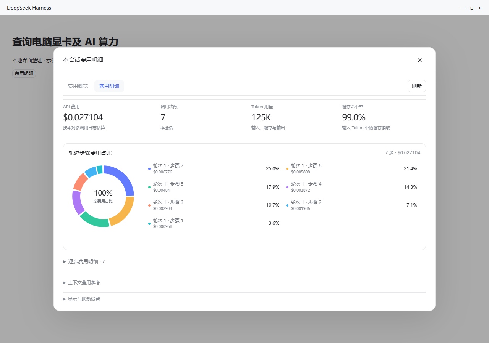
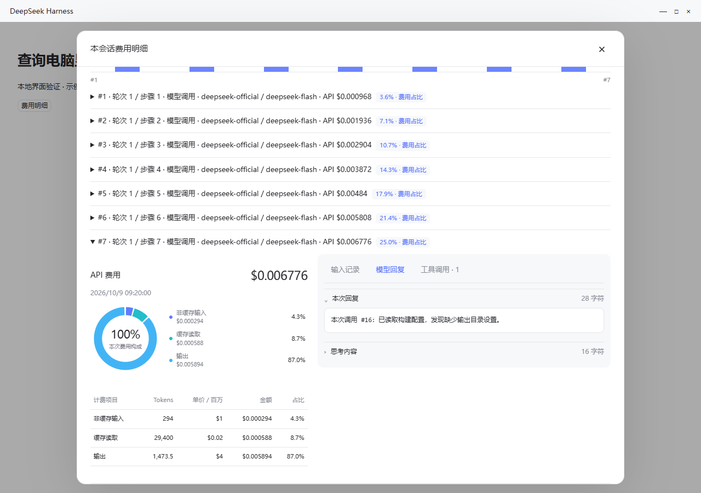
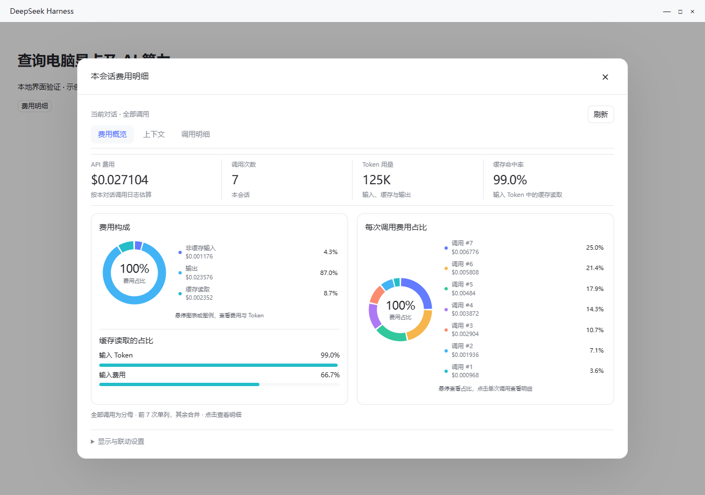
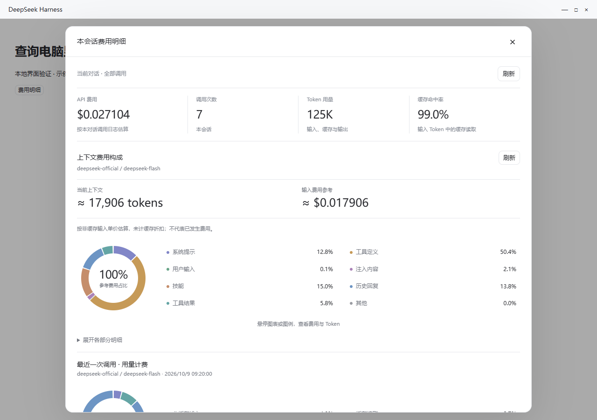

# 上下文费用展示与 dsh-context 联动

## 使用方式

点击对话输入区的费用明细，只查看当前对话。费用概览集中显示总费用、调用次数、Token、缓存命中率和费用构成；计费轨迹直接显示在概览，逐次调用明细原位展开；“费用明细”默认用一张圆环图汇总全部轨迹步骤费用，每块代表一步。逐步独立圆环和上下文参考默认折叠。设置中的计费统计保留跨对话查询入口。

“步骤费用构成”按已有轨迹步骤汇总费用，显示每步金额与全会话占比。超过 20 步时，费用最高的 20 步单列，其余合并为一块，所有步骤均计入分母。“计费轨迹”逐步列出输入、输出、缓存金额及占比，点击步骤可展开 Token、单价和金额。多个工具属于同一步时，整步模型费用只计一次；工具名称用于识别步骤，不把整笔费用重复分摊给各工具。缺少步骤编号的调用单列。

步骤统计只提取日志中的轮次、步骤、工具名称和用量，不读取文本做内容分类。默认连续显示 100 步，更多步骤在原位置展开；统计分母始终覆盖完整会话。已完成日志的工具名称索引缓存按文件大小和修改时间失效，实时会话按事件变化刷新。

逐次调用图按整个查询范围计算占比，显示费用最高的 7 次和其余合计。点击单次调用可跨页定位；展开后左侧为费用圆环与计费明细，右侧切换“输入记录、模型回复、工具调用”。各计费项目显示 Token、每百万 Token 单价、金额与占比；点击圆环项目可切换到相关内容。缓存对比展示缓存读取占输入 Token 和输入费用的比例，多模型或多环节时显示相应费用分布。

输入记录区分本轮用户输入、技能、注入内容与上一步工具返回；回复区展示正文及已记录的思考；工具区显示参数、返回结果、状态与耗时。读取内容时核对会话、计费事件序号与时间。输入记录不是完整 HTTP 请求体，不含请求头；提供商没有逐段缓存归属数据，费用不按这些文本片段硬分摊。工具的输出文本也不作为独立模型调用重复计费。

原始内容只在展开单次调用时读取。每段文本上限 16,000 字符，超出标记截取；工具每页 20 项。附件仅显示类型；未保存的内容显示缺失状态。所有内容使用纯文本显示。

圆环图显示整体构成，右侧图例列出各部分百分比。悬停或用键盘聚焦圆环/图例，即可看到该部分的 Token、金额与占比。鼠标移走或焦点移出后恢复整体视图，不留下选中状态。很小的部分也可通过图例查看。完整明细默认折叠。关闭按钮固定在弹窗顶部，滚动到底部仍然可用，也可按 Esc 关闭。

联动开关在对话弹窗底部的“显示与联动设置 → dsh-context 联动”中；全局统计也保留折叠入口。初次提示可关闭，之后通过“查看启用前后预览”重新打开。

图中为本地示例数据。参考输入费用与已发生调用费用分开展示，不相加。

## 调研结果

核对了 [dsh-context 源码](https://github.com/bowenliang123/dsh-context/tree/d3f23994405a3e876c37567f9a5b8aa9a3b1e843)、npm 发布的 0.62.0 和 0.66.0 客户端，以及 DSH 0.2.0-rc.2 的公开接口。

dsh-context 主要展示上下文占用、组成、变化和注入事件。0.66.0 还包括会话费用估算、用量趋势和跨会话概览，费用参考 models.dev 的公开价格。它没有本次讨论中的保留比例、缓存假设和节省预测控件。[功能说明](https://github.com/bowenliang123/dsh-context/blob/d3f23994405a3e876c37567f9a5b8aa9a3b1e843/README.md)

本次实现只读的费用拆分。用户通过金额和占比了解主要费用来源，自行决定是否精简信息、减少工具输出或调整使用方式。界面不提供模拟预算、压缩按钮或自动优化。

## 独立功能

不需要安装 dsh-context。入口在本插件的单会话费用统计中；会话输入区的费用明细入口会直接打开当前会话，也可以在设置中的计费统计选择会话。

| 内容 | 展示方式 | 数据依据 |
|---|---|---|
| 当前上下文 | Token 总量、参考输入金额 | DSH `tokenMeter.measure()` |
| 上下文各部分 | 系统提示、工具定义、用户输入、注入内容、技能、历史回复、工具结果、其他；逐项显示 Token、金额及占比 | 宿主组成投影与当前可见节点 |
| 最近一次调用 | 非缓存输入、缓存读取、缓存写入、输出、单独推理费用；逐项金额、占比和合计 | 提供商返回的用量，复用本插件的计费引擎 |
| 历史及其他环节 | 原有轮次明细、搜索和压缩费用继续保留 | 现有账本和调用明细 |

当前上下文参考金额使用最近请求模型的非缓存输入单价，遵循峰谷、币种转换、长上下文及自定义价格配置。分类金额属于参考值，未计缓存折扣，不是逐项实际账单。提供商没有返回每段上下文的缓存命中情况，不能精确反推每段实际扣费。同一费率下，分类费用占比与 Token 占比相同。

最近一次调用使用该次调用的输入长度、发生时段与提供商用量单独计价，输入、缓存、输出之间不重复计数。历史回复留在当前上下文时属于输入。两组金额不相加；Plan 显示 API 等值，未知价格与零单价分别显示。

## 可选联动

联动默认关闭。启用已验证版本的 dsh-context 后，首次提示提供“启用前 / 启用后”预览和明确的示例数据标识，用户选择后才增加费用区域。

启用后，费用区域位于 dsh-context 的当前上下文卡片内部，覆盖会话页、右侧栏与 `/context` 弹窗。未启用或关闭联动时，本插件的独立费用展示继续可用。

- 支持明确验证的 dsh-context 0.62.0、0.66.0。宿主通过本地 `pluginManager.listBundles()` 提供版本；未知版本不会自动启用。
- 开关和“已提示”状态保存在本插件配置中。关闭按钮、Esc、点击遮罩和“暂不启用”均可退出；退出不等待保存请求。浏览器另存提示记录，防止保存失败、重新载入或多个页面造成反复提示。
- 用户手动重开预览再关闭，不改变已经启用的开关。设置中始终保留开关与预览入口。
- 自动提示等其他弹窗关闭后再出现。短窗口保持关闭按钮和操作区可见，避开 DSH 桌面标题栏，支持键盘焦点限制与关闭后恢复焦点。
- 复用 dsh-context 的公开 `contextTimeline.current` 分类；不修改对方文件。通过 DSH 公共插槽优先级包装原组件，保留原 props、语言、会话和 hooks。关闭或卸载时撤销自己的注册。
- 尚未验证的插槽结构不会被覆盖；原面板保留，独立入口继续使用。

## 加载与实时性

当前会话稳定显示 300 毫秒后提前准备本地统计，悬停或聚焦入口也可触发准备。同一会话、筛选和计价配置的内存结果先显示，再后台刷新，避免等待时清空界面；缓存最多 32 项，仅存在于当前插件实例，卸载后清理。概览不等待上下文测量，切换上下文视图后才读取。

子代理目录查询共享在途请求，持久化目录复用 5 秒，实时会话目录每次合并。首次设置页先显示本地数据，再补齐余额与额度；修改小数位等显示选项不等待无关的冷额度请求。显式额度刷新和查询配置变更仍等待对应结果。

## 实时性与费用

可见界面响应宿主组成和用量变化，并以 10 秒间隔补充刷新。隐藏页面和不可见区域暂停查询。失败保留同一会话的旧数据并显示提示，切换会话时不串用旧结果。

这些查询只读取宿主已有数据和已配置价格，不调用模型或外部价格接口，不修改消息、模型选择、价格设置或账本，不产生额外模型 API 费用。

## 实现依据

- [dsh-context 分类定义](https://github.com/bowenliang123/dsh-context/blob/d3f23994405a3e876c37567f9a5b8aa9a3b1e843/src/client/categories.ts)：七种分类及主题颜色。
- [dsh-context 当前上下文卡片](https://github.com/bowenliang123/dsh-context/blob/d3f23994405a3e876c37567f9a5b8aa9a3b1e843/src/client/components/CurrentComposition.tsx)：`data-lc-current` 位置。
- [DSH token-meter](https://github.com/deepseek-ai/deepseek-harness/tree/master/packages/llm/token-meter)：总量、可见节点和官方组成投影。
- DSH 本地发布包的 `SlotCore`、`SessionProjectionRegistry` 与 `PluginManager` 类型声明：插槽注册、投影和安装版本读取接口。

## 验证范围

本地合成会话用于核对分类金额总和、长上下文阈值、缓存与输出计价、人民币换算、Plan、零价格和未定价。真实 DSH Session、TokenMeter 和投影服务用于核对取数接口及只读行为。真实发布的 dsh-context 客户端和 SlotCore 用于验证三个界面入口、先后安装、会话隔离、开关及卸载。

浏览器检查覆盖明暗主题、窄屏和短窗口、预览、关闭方式、焦点恢复及保存失败。预览采用示例数据，所有模型和外部网络请求均被禁用。

## English

Each expanded call pairs a cost donut and a token/rate/cost/share table with Inputs, Response and Tools views. Inputs separate user text, skills, injected context and preceding tool results. Response includes recorded reasoning; tools show arguments, results, status and duration. Content is fetched only when expanded and matched by session, billed event sequence and timestamp. Excerpts are bounded to 16,000 characters per text field, tools are paged by 20, and attachments are represented by type. Missing content remains explicit. Input excerpts are not a complete HTTP request; per-message cache attribution is unavailable, so costs are not apportioned by text length.

Open **Cost details** beside the conversation input to see only that conversation: call-log totals, context composition, latest-call charges and turn/call details. Cross-conversation statistics remain available in Settings.

Overview and Cost details are the two main views. Overview keeps the input/output/cache composition beside step cost composition and a compact billing trajectory. Cost details opens one aggregate donut: each slice represents a trajectory step’s share of the full session cost. The top 20 steps are separate slices; any remaining steps are combined without dropping their costs. Individual step donuts and token/rate/cost tables are in a collapsed section; context references are also collapsed. Individual call records expand within Overview. Overview includes per-call shares across the full selection, cache token/cost comparisons and conditional model/activity charts. The seven highest-cost calls are individual slices; the rest are combined. Select a call to open its details, even on another page. Donut charts use a brighter palette with compact percentage legends. Hover or focus a slice or legend item to inspect its amount and tokens, including tiny categories. Leaving the chart or moving keyboard focus away clears the highlight. Expanding the individual-step section reveals its billing tables, which can also be collapsed. The close button stays visible while scrolling; Escape also closes the dialog. Dialogs follow DSH popup background tokens, including dsh-dream-skin opacity.

Expand **Display and integration settings → dsh-context integration** to enable or disable the optional integration or reopen its before/after preview. Supported versions are 0.62.0 and 0.66.0. Integration starts off; dismissing the initial prompt prevents repeated automatic prompts. When enabled, costs appear inside the peer's current-context card in the conversation tab, right sidebar and `/context` overlay.

Context amounts use uncached input rates as a reference; they are not itemized bills. Latest-call amounts use reported usage and configured rates, with Plan amounts shown as API equivalents. These amounts are separate and must not be added together. Unknown prices are not treated as free. Visible views react to local changes and refresh every 10 seconds; hidden views pause. No model requests or additional model API charges are introduced, and no context or ledger data is changed.

The current conversation is preloaded after a short idle delay. Reopening first displays its in-memory snapshot, isolated by conversation, filters and pricing rules, then refreshes in the background. Context measurement is deferred until its view is opened. Concurrent reads are coalesced; cache entries are bounded and refreshed in the background. Persisted session headers are shared for five seconds and live headers are merged every time. The first Settings view and local display-setting saves do not wait for unrelated balance/quota queries. Price settings reuse their last catalog snapshot during refresh.
