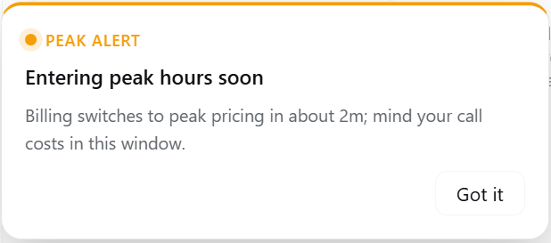
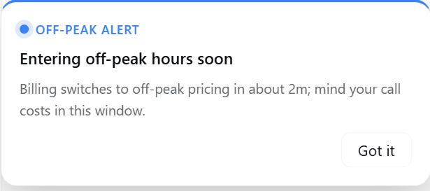
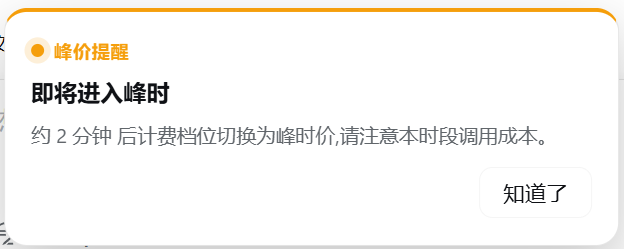
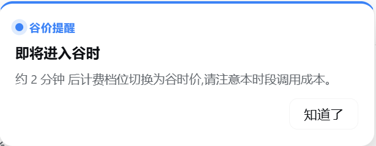
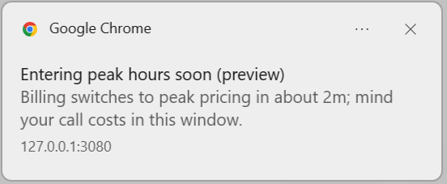
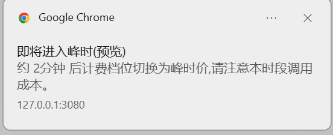
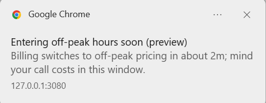
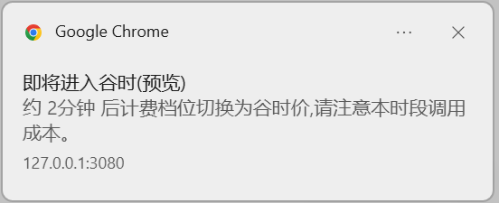

# Peak/Off-Peak Switch Alerts

dsh-cost-meter proactively warns you **before** the billing tier switches between peak and off-peak hours, so you can schedule expensive calls into the cheaper window. Alerts go out over two channels — an **in-page popup** and a **browser (system) notification** — in both English and Chinese, with configurable styling and position.

## Overview

| Item | Details |
|---|---|
| Trigger | When the next tier switch is within the configured lead time (default **2 minutes**, 1–30 configurable) |
| In-page popup | dsh-styled alert card — amber top bar for peak, blue for off-peak; position selectable: **bottom-right / screen center** |
| System notification | Via the browser Web Notification API — reaches you even when the page is minimized or backgrounded (permission required) |
| Alert type | Entering peak only, entering off-peak only, or both (default) |
| Frequency | One alert per switch point; clicking "Got it" records it and stops the nagging |
| Language | Follows the plugin UI language (Simplified Chinese / English / follow browser) |

## In-Page Popup

Entering peak hours — amber alert bar + "PEAK ALERT" badge:

Entering off-peak hours — blue info bar + "OFF-PEAK ALERT" badge:

The same popups under the Chinese UI (copy follows the language setting; styling is identical):

| 进入峰 (peak) | 进入谷 (off-peak) |
|---|---|
|  |  |

Card anatomy: a colored **top bar** signals the alert level → a **dot badge** marks peak vs off-peak → title → countdown body ("Billing switches to peak pricing in about 2m…") → the **Got it** button. The countdown is computed from the real switch point, and the popup dismisses itself once the switch completes.

## Browser (System) Notifications

With "Also send a system notification" enabled, every popup trigger also posts an OS-level notification — **delivered even when the page is minimized or the browser is in the background**:

| English UI | Chinese UI |
|---|---|
|  |  |
|  |  |

The first time you enable the toggle, the browser asks for notification permission — choose "Allow". If you previously denied it, re-enable it via the site settings behind the padlock icon in the address bar. Notification title/body mirror the in-page popup; notifications fired from the preview carry a "(preview)" tag in the title.

## Settings

All options live in **Settings → Cost → Peak/off-peak pricing & notice** (next to the peak-hours strip styling controls):

| Setting | Values | Default |
|---|---|---|
| Peak/off-peak switch popup alert | on / off | on |
| Lead time | 1–30 minutes | 2 minutes |
| Alert type | entering peak / entering off-peak / both | both |
| Popup position | bottom-right / screen center | bottom-right |
| Also send a system notification | on / off | off |
| Preview the popup | Preview entering peak / Preview entering off-peak | — |

The **preview buttons** render through the real component: copy language, popup position and system notifications all follow your current configuration exactly as they will fire live — no need to wait for an actual switch point.

## Tips

- A **lead time** of 2–5 minutes works best: shorter leaves no time to react, longer gets forgotten. For long-running tasks, consider pausing before peak and resuming in the off-peak window.
- Only worried about costly peak hours? Set the alert type to **entering peak** and stay undisturbed when prices drop.
- Re-enabling notifications after a denial: address bar → site settings → Notifications → Allow, then hit "Preview entering peak" in Settings to verify the chain.
- The popup renders on every page (including the session-less welcome and settings pages); you can also trigger a real preview from the console with `window.cmPeakAlertPreview('peak' | 'offpeak')`.

## Related docs

- [README](../README.en.md) — feature overview
- [Model & Plan adaptation guide](model-and-plan-adaptation.en.md) — peak/off-peak billing rules and vendor price sources
