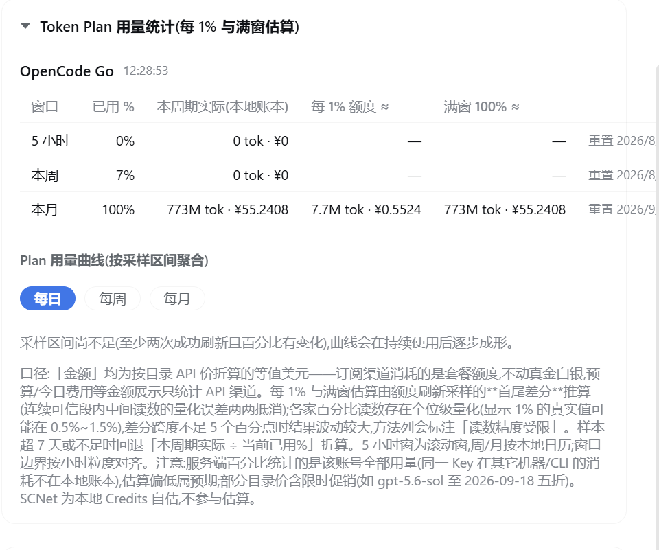
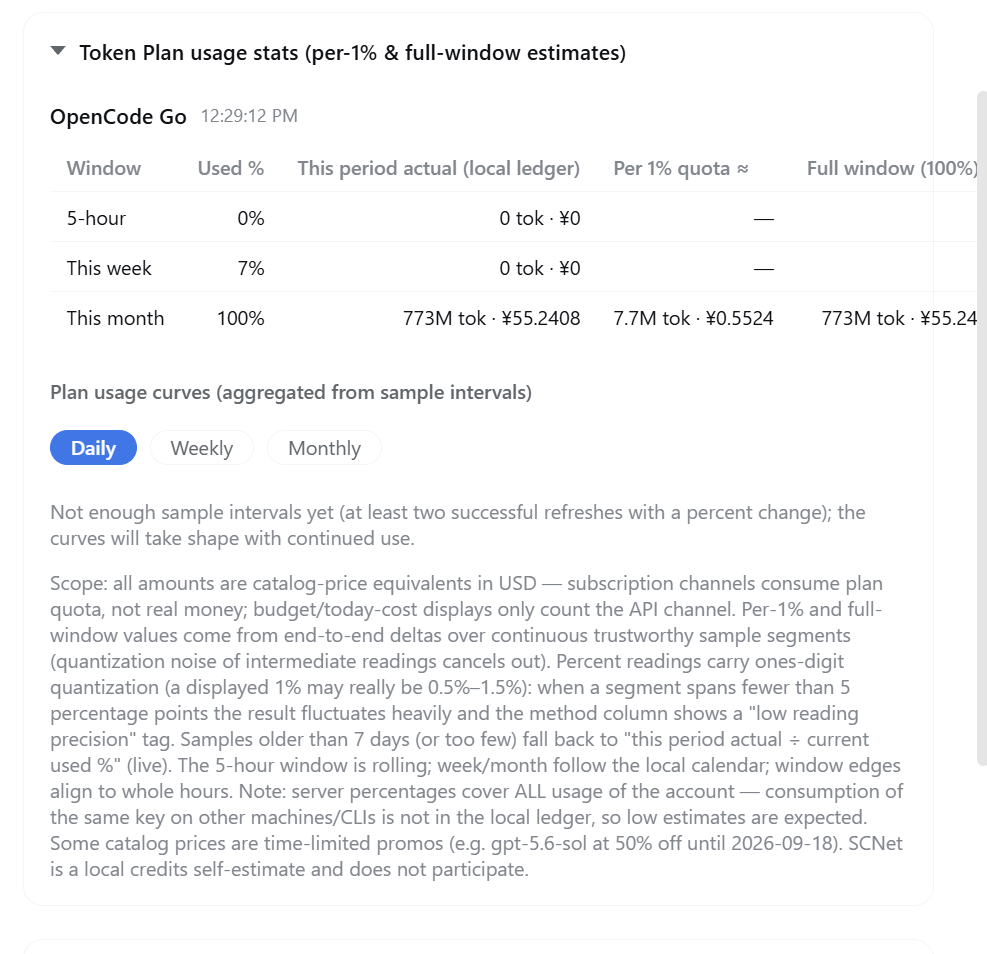

# Token Plan 用量统计面板说明 / Token Plan Usage Stats Guide

> 入口 / Where: dsh web → **费用设置(Cost) → 用量(Usage) → Token Plan 用量统计**
> 面板标题:*「Token Plan 用量统计(每 1% 与满窗估算)」/ "Token Plan usage stats (per-1% & full-window estimates)"*

## 中文

### 面板截图

### 这是什么

订阅制渠道(OpenCode Go、MiniMax、Codex 手动标记等)的额度不产生真实账单,插件通过**定期刷新厂商额度接口的已用百分比采样**来回答三个问题:

| 列 | 含义 |
|---|---|
| 窗口 | 5 小时(滚动)/ 本周 / 本月;窗口边界按小时粒度对齐,周/月按本地日历 |
| 已用 % | 厂商接口返回的官方读数(**该账号全部用量**,含其它机器/CLI) |
| 本周期实际(本地账本) | 同一窗口内**只在 dsh 里发起的调用**按目录 API 价折算的 token 与等值金额 |
| 每 1% 额度 ≈ | 由采样**首尾差分**推算:每 1% 百分比 ≈ 多少 token / 多少等值金额 |
| 满窗 100% ≈ | 每 1% × 100,即这个窗口吃满时的总量折算 |

### 估算方法与精度

- **首尾差分**:把样本切成「连续可信段」做端点差分——中间读数的量化误差两两抵消;差分跨度 ≥5 个百分点时结果可信(方法列无标注),不足时波动较大并标注**「读数精度受限」**。
- **回退(live)**:样本超 7 天或不足两次成功刷新时,退回「本周期实际 ÷ 当前已用%」折算,精度最低。
- **用量曲线**:每日/每周/每月三种聚合,按采样区间累加(Σtokens÷Σpct),随使用时间逐步成形。

### 口径边界(重要)

- 本面板的**「本期实际」与每 1%/满窗估算只统计在 dsh 内发起的调用**——同一 Key 在其它机器/CLI 的消耗不进本地账本;
- 服务端「已用%」是该账号**全部用量**:两者之差即其它渠道消耗,因此本地数字偏低属预期;
- 「金额」是目录价折算的**等值美元**(订阅消耗的是套餐额度,不动真金白银);预算/今日费用等金额展示仍只统计 API 真金白银口径;
- SCNet 为本地 Credits 自估,不参与百分比采样估算。

---

## English

### Screenshot

### What it is

For subscription channels (OpenCode Go, MiniMax, manually-flagged Codex, …) nothing is billed per call, so the plugin polls each vendor's quota endpoint and samples the reported used-percentage to answer three questions:

| Column | Meaning |
|---|---|
| Window | 5-hour (rolling) / this week / this month; edges align to whole hours, week/month follow the local calendar |
| Used % | Official reading from the vendor (**entire account**, including other machines/CLIs) |
| This period actual (local ledger) | Tokens and catalog-price equivalent cost of calls made **inside dsh only**, within the same window |
| Per 1% quota ≈ | End-to-end sample delta estimate: how many tokens / how much equivalent cost one percentage point represents |
| Full window (100%) ≈ | Per-1% × 100 — what a fully consumed window adds up to |

### Method & precision

- **End-to-end deltas**: samples are cut into continuous trustworthy segments; endpoint deltas cancel intermediate quantization noise. Segments spanning ≥5 percentage points are reliable; shorter ones fluctuate and get a **"low reading precision"** tag.
- **Live fallback**: with samples older than 7 days (or fewer than two successful refreshes), values fall back to "this period actual ÷ current used %".
- **Usage curves**: daily/weekly/monthly aggregation over sample intervals (Σtokens ÷ Σpct); they take shape as usage accumulates.

### Scope boundary (important)

- The **local-ledger column and all estimates cover calls made inside dsh only** — the same key used from other machines/CLIs never enters this ledger;
- Server "used %" covers the **whole account**: the difference between the two is consumption elsewhere, so low local numbers are expected;
- Amounts are catalog-price **equivalents** (subscriptions spend plan quota, not real money); budget/today-cost displays still count real-money API channels only;
- SCNet uses local Credits self-metering and does not participate in percent sampling.

---

相关文档 / See also: [CHANGELOG](../CHANGELOG.md) · [安全审计 v1.6.1](security-audit-v1.6.1.md)
